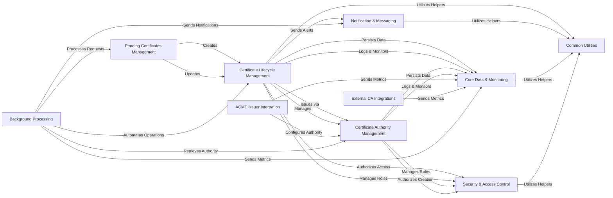

## Component Details

This architecture outlines the core components of Lemur, a system designed for comprehensive digital certificate lifecycle management. The main flow revolves around the creation, issuance, and ongoing management of certificates, starting from pending requests, through various Certificate Authority integrations, and culminating in the active lifecycle management of issued certificates. Background processes automate routine tasks, while core services handle data persistence, security, and notifications, ensuring a robust and secure certificate management ecosystem.

### Pending Certificates Management
This component is responsible for managing the lifecycle of certificates that are awaiting issuance. It handles the creation, retrieval, updating, and cancellation of pending certificate requests, interacting with various services for data persistence, naming, and parsing.

**Related Classes/Methods**:

- `lemur.pending_certificates.models` (full file reference)
- `lemur.pending_certificates.views` (full file reference)
- `lemur.pending_certificates.service` (full file reference)
- `lemur.pending_certificates.schemas` (full file reference)
- <a href="https://github.com/netflix/lemur/blob/master/lemur/pending_certificates/cli.py#L24-L25" target="_blank" rel="noopener noreferrer">`lemur.pending_certificates.cli` (24:25)</a>

### Certificate Lifecycle Management
This component manages the entire lifecycle of issued certificates within Lemur. It covers certificate creation, import, updates, revocation, deactivation, and various queries. It also includes functionalities for certificate integrity checks and verification.

**Related Classes/Methods**:

- `lemur.certificates.models` (full file reference)
- `lemur.certificates.views` (full file reference)
- `lemur.certificates.service` (full file reference)
- `lemur.certificates.schemas` (full file reference)
- `lemur.certificates.cli` (full file reference)
- <a href="https://github.com/netflix/lemur/blob/master/lemur/certificates/verify.py#L160-L198" target="_blank" rel="noopener noreferrer">`lemur.certificates.verify` (160:198)</a>
- `lemur.certificates.utils` (full file reference)

### Certificate Authority Management
This component is responsible for the administration of Certificate Authorities (CAs) within the Lemur system. It handles the creation, retrieval, and updating of CA configurations, including their associated roles and plugins.

**Related Classes/Methods**:

- `lemur.authorities.models` (full file reference)
- `lemur.authorities.views` (full file reference)
- `lemur.authorities.service` (full file reference)
- `lemur.authorities.schemas` (full file reference)

### ACME Issuer Integration
This plugin facilitates the issuance and revocation of certificates using the Automatic Certificate Management Environment (ACME) protocol. It interacts with ACME handlers and challenge types to manage the certificate ordering process, particularly for DNS-01 and HTTP-01 challenges.

**Related Classes/Methods**:

- `lemur.plugins.lemur_acme.plugin` (full file reference)
- `lemur.plugins.lemur_acme.acme_handlers` (full file reference)
- `lemur.plugins.lemur_acme.challenge_types` (full file reference)

### External CA Integrations
This component encompasses various plugins that integrate with external Certificate Authorities (CAs) like DigiCert, Google CA, Entrust, Verisign, and internal cryptography-based issuance. These plugins abstract the complexities of interacting with different CA APIs for certificate creation and revocation.

**Related Classes/Methods**:

- `lemur.plugins.lemur_digicert.plugin` (full file reference)
- `lemur.plugins.lemur_google_ca.plugin` (full file reference)
- `lemur.plugins.lemur_entrust.plugin` (full file reference)
- `lemur.plugins.lemur_verisign.plugin` (full file reference)
- `lemur.plugins.lemur_cryptography.plugin` (full file reference)
- `lemur.plugins.lemur_cfssl.plugin` (full file reference)

### Core Data & Monitoring
This component provides foundational services essential for the operation of Lemur, including database interactions for data persistence, logging mechanisms for auditing and debugging, and metrics collection for monitoring system performance and usage.

**Related Classes/Methods**:

- `lemur.database` (full file reference)
- `lemur.logs.service` (full file reference)
- <a href="https://github.com/netflix/lemur/blob/master/lemur/metrics.py#L12-L38" target="_blank" rel="noopener noreferrer">`lemur.metrics.Metrics` (12:38)</a>

### Security & Access Control
This component is responsible for managing user authentication, defining and enforcing permissions, and handling user roles within the Lemur application. It ensures that users have appropriate access to resources and functionalities.

**Related Classes/Methods**:

- `lemur.auth.service` (full file reference)
- `lemur.auth.permissions` (full file reference)
- `lemur.roles.service` (full file reference)

### Common Utilities
This component provides a collection of general-purpose utility functions and helper classes used across various parts of the Lemur application. These include functions for data parsing, validation, default value generation, and other common operations.

**Related Classes/Methods**:

- `lemur.common.utils` (full file reference)
- `lemur.common.defaults` (full file reference)
- `lemur.common.schema` (full file reference)
- `lemur.common.validators` (full file reference)
- `lemur.common.missing` (full file reference)

### Background Processing
This component handles the execution of background and scheduled tasks using Celery. It orchestrates operations like fetching ACME certificates, reissuing and rotating certificates, and performing periodic checks, ensuring that long-running processes do not block the main application flow.

**Related Classes/Methods**:

- `lemur.common.celery` (full file reference)

### Notification & Messaging
This component is responsible for generating and sending various notifications related to certificate lifecycle events, such as expirations, revocations, and reissuance failures. It ensures timely communication to relevant stakeholders.

**Related Classes/Methods**:

- `lemur.notifications.service` (full file reference)
- `lemur.notifications.messaging` (full file reference)

### [FAQ](https://github.com/CodeBoarding/GeneratedOnBoardings/tree/main?tab=readme-ov-file#faq)