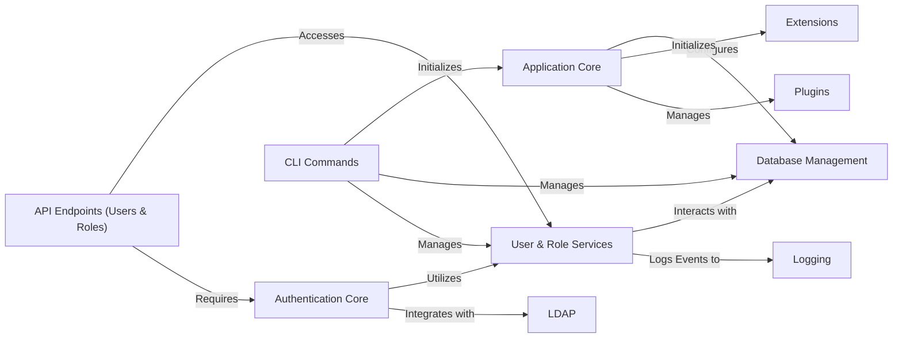

## Component Details

The Core Application Infrastructure component of Lemur is responsible for establishing the foundational environment for the application. This includes the initial setup of the Flask application, loading configurations, managing database connections and migrations, and integrating various Flask extensions for ORM, security, and metrics. It also encompasses the core functionalities for user and role management, including persistence, authentication, and authorization, and provides command-line interfaces for administrative tasks. The overall flow involves the application core initializing and configuring the necessary services, which then interact with the database for data persistence, handle user authentication and authorization, and expose these functionalities through both RESTful APIs and command-line tools.

### Application Core
The central part of the Lemur application, responsible for overall application creation, configuration, and global hooks. It sets up the Flask application, initializes extensions, configures logging, and installs plugins, ensuring the application is ready to run.

**Related Classes/Methods**:

- <a href="https://github.com/netflix/lemur/blob/master/lemur/factory.py#L40-L82" target="_blank" rel="noopener noreferrer">`lemur.factory:create_app` (40:82)</a>
- <a href="https://github.com/netflix/lemur/blob/master/lemur/factory.py#L115-L147" target="_blank" rel="noopener noreferrer">`lemur.factory:configure_app` (115:147)</a>
- <a href="https://github.com/netflix/lemur/blob/master/lemur/factory.py#L150-L191" target="_blank" rel="noopener noreferrer">`lemur.factory:configure_extensions` (150:191)</a>
- <a href="https://github.com/netflix/lemur/blob/master/lemur/factory.py#L211-L248" target="_blank" rel="noopener noreferrer">`lemur.factory:configure_logging` (211:248)</a>
- <a href="https://github.com/netflix/lemur/blob/master/lemur/factory.py#L251-L295" target="_blank" rel="noopener noreferrer">`lemur.factory:install_plugins` (251:295)</a>
- <a href="https://github.com/netflix/lemur/blob/master/lemur/factory.py#L85-L112" target="_blank" rel="noopener noreferrer">`lemur.factory:from_file` (85:112)</a>
- <a href="https://github.com/netflix/lemur/blob/master/lemur/factory.py#L194-L203" target="_blank" rel="noopener noreferrer">`lemur.factory:configure_blueprints` (194:203)</a>
- <a href="https://github.com/netflix/lemur/blob/master/lemur/factory.py#L206-L208" target="_blank" rel="noopener noreferrer">`lemur.factory:configure_database` (206:208)</a>
- <a href="https://github.com/netflix/lemur/blob/master/lemur/manage.py#L52-L53" target="_blank" rel="noopener noreferrer">`lemur.manage:cli` (52:53)</a>
- <a href="https://github.com/netflix/lemur/blob/master/lemur/manage.py#L398-L421" target="_blank" rel="noopener noreferrer">`lemur.manage:start` (398:421)</a>
- `lemur.extensions` (full file reference)
- `lemur.plugins` (full file reference)
- <a href="https://github.com/netflix/lemur/blob/master/lemur/common/health.py#L19-L25" target="_blank" rel="noopener noreferrer">`lemur.common.health` (19:25)</a>

### Database Management
This component provides a robust abstraction layer for all database interactions, ensuring data consistency and simplifying common database operations across the application. It includes functionalities for querying, filtering, sorting, creating, updating, and deleting records.

**Related Classes/Methods**:

- <a href="https://github.com/netflix/lemur/blob/master/lemur/database.py#L25-L37" target="_blank" rel="noopener noreferrer">`lemur.database:filter_none` (25:37)</a>
- <a href="https://github.com/netflix/lemur/blob/master/lemur/database.py#L40-L50" target="_blank" rel="noopener noreferrer">`lemur.database:session_query` (40:50)</a>
- <a href="https://github.com/netflix/lemur/blob/master/lemur/database.py#L53-L63" target="_blank" rel="noopener noreferrer">`lemur.database:create_query` (53:63)</a>
- <a href="https://github.com/netflix/lemur/blob/master/lemur/database.py#L66-L70" target="_blank" rel="noopener noreferrer">`lemur.database:commit` (66:70)</a>
- <a href="https://github.com/netflix/lemur/blob/master/lemur/database.py#L73-L77" target="_blank" rel="noopener noreferrer">`lemur.database:rollback` (73:77)</a>
- <a href="https://github.com/netflix/lemur/blob/master/lemur/database.py#L80-L87" target="_blank" rel="noopener noreferrer">`lemur.database:add` (80:87)</a>
- <a href="https://github.com/netflix/lemur/blob/master/lemur/database.py#L90-L97" target="_blank" rel="noopener noreferrer">`lemur.database:get_model_column` (90:97)</a>
- <a href="https://github.com/netflix/lemur/blob/master/lemur/database.py#L100-L118" target="_blank" rel="noopener noreferrer">`lemur.database:find_all` (100:118)</a>
- <a href="https://github.com/netflix/lemur/blob/master/lemur/database.py#L121-L135" target="_blank" rel="noopener noreferrer">`lemur.database:find_any` (121:135)</a>
- <a href="https://github.com/netflix/lemur/blob/master/lemur/database.py#L138-L148" target="_blank" rel="noopener noreferrer">`lemur.database:get` (138:148)</a>
- <a href="https://github.com/netflix/lemur/blob/master/lemur/database.py#L151-L161" target="_blank" rel="noopener noreferrer">`lemur.database:get_all` (151:161)</a>
- <a href="https://github.com/netflix/lemur/blob/master/lemur/database.py#L164-L178" target="_blank" rel="noopener noreferrer">`lemur.database:create` (164:178)</a>
- <a href="https://github.com/netflix/lemur/blob/master/lemur/database.py#L181-L190" target="_blank" rel="noopener noreferrer">`lemur.database:update` (181:190)</a>
- <a href="https://github.com/netflix/lemur/blob/master/lemur/database.py#L193-L201" target="_blank" rel="noopener noreferrer">`lemur.database:delete` (193:201)</a>
- <a href="https://github.com/netflix/lemur/blob/master/lemur/database.py#L204-L214" target="_blank" rel="noopener noreferrer">`lemur.database:filter` (204:214)</a>
- <a href="https://github.com/netflix/lemur/blob/master/lemur/database.py#L217-L228" target="_blank" rel="noopener noreferrer">`lemur.database:sort` (217:228)</a>
- <a href="https://github.com/netflix/lemur/blob/master/lemur/database.py#L231-L255" target="_blank" rel="noopener noreferrer">`lemur.database:update_list` (231:255)</a>
- <a href="https://github.com/netflix/lemur/blob/master/lemur/database.py#L258-L267" target="_blank" rel="noopener noreferrer">`lemur.database:clone` (258:267)</a>
- <a href="https://github.com/netflix/lemur/blob/master/lemur/database.py#L270-L309" target="_blank" rel="noopener noreferrer">`lemur.database:get_count` (270:309)</a>
- <a href="https://github.com/netflix/lemur/blob/master/lemur/database.py#L312-L340" target="_blank" rel="noopener noreferrer">`lemur.database:sort_and_page` (312:340)</a>
- `lemur.extensions:db` (full file reference)
- `lemur.extensions:migrate` (full file reference)

### User & Role Services
This component encapsulates the business logic for managing user accounts and roles within the Lemur system. It handles operations such as creating new users and roles, updating existing details, retrieving information, and managing role assignments.

**Related Classes/Methods**:

- <a href="https://github.com/netflix/lemur/blob/master/lemur/users/service.py#L19-L45" target="_blank" rel="noopener noreferrer">`lemur.users.service:create` (19:45)</a>
- <a href="https://github.com/netflix/lemur/blob/master/lemur/users/service.py#L48-L76" target="_blank" rel="noopener noreferrer">`lemur.users.service:update` (48:76)</a>
- <a href="https://github.com/netflix/lemur/blob/master/lemur/users/service.py#L79-L114" target="_blank" rel="noopener noreferrer">`lemur.users.service:update_roles` (79:114)</a>
- <a href="https://github.com/netflix/lemur/blob/master/lemur/users/service.py#L117-L124" target="_blank" rel="noopener noreferrer">`lemur.users.service:get` (117:124)</a>
- <a href="https://github.com/netflix/lemur/blob/master/lemur/users/service.py#L127-L134" target="_blank" rel="noopener noreferrer">`lemur.users.service:get_by_email` (127:134)</a>
- <a href="https://github.com/netflix/lemur/blob/master/lemur/users/service.py#L137-L144" target="_blank" rel="noopener noreferrer">`lemur.users.service:get_by_username` (137:144)</a>
- <a href="https://github.com/netflix/lemur/blob/master/lemur/users/service.py#L147-L154" target="_blank" rel="noopener noreferrer">`lemur.users.service:get_all` (147:154)</a>
- <a href="https://github.com/netflix/lemur/blob/master/lemur/users/service.py#L157-L173" target="_blank" rel="noopener noreferrer">`lemur.users.service:render` (157:173)</a>
- <a href="https://github.com/netflix/lemur/blob/master/lemur/roles/service.py#L20-L27" target="_blank" rel="noopener noreferrer">`lemur.roles.service:warn_user_updates` (20:27)</a>
- <a href="https://github.com/netflix/lemur/blob/master/lemur/roles/service.py#L30-L50" target="_blank" rel="noopener noreferrer">`lemur.roles.service:update` (30:50)</a>
- <a href="https://github.com/netflix/lemur/blob/master/lemur/roles/service.py#L53-L67" target="_blank" rel="noopener noreferrer">`lemur.roles.service:set_third_party` (53:67)</a>
- <a href="https://github.com/netflix/lemur/blob/master/lemur/roles/service.py#L70-L95" target="_blank" rel="noopener noreferrer">`lemur.roles.service:create` (70:95)</a>
- <a href="https://github.com/netflix/lemur/blob/master/lemur/roles/service.py#L98-L105" target="_blank" rel="noopener noreferrer">`lemur.roles.service:get` (98:105)</a>
- <a href="https://github.com/netflix/lemur/blob/master/lemur/roles/service.py#L108-L115" target="_blank" rel="noopener noreferrer">`lemur.roles.service:get_by_name` (108:115)</a>
- <a href="https://github.com/netflix/lemur/blob/master/lemur/roles/service.py#L118-L128" target="_blank" rel="noopener noreferrer">`lemur.roles.service:delete` (118:128)</a>
- <a href="https://github.com/netflix/lemur/blob/master/lemur/roles/service.py#L131-L154" target="_blank" rel="noopener noreferrer">`lemur.roles.service:render` (131:154)</a>
- <a href="https://github.com/netflix/lemur/blob/master/lemur/roles/service.py#L157-L162" target="_blank" rel="noopener noreferrer">`lemur.roles.service:get_or_create` (157:162)</a>
- <a href="https://github.com/netflix/lemur/blob/master/lemur/users/models.py#L35-L108" target="_blank" rel="noopener noreferrer">`lemur.users.models.User` (35:108)</a>
- <a href="https://github.com/netflix/lemur/blob/master/lemur/users/models.py#L63-L72" target="_blank" rel="noopener noreferrer">`lemur.users.models.User:check_password` (63:72)</a>
- <a href="https://github.com/netflix/lemur/blob/master/lemur/users/models.py#L74-L81" target="_blank" rel="noopener noreferrer">`lemur.users.models.User:hash_password` (74:81)</a>
- <a href="https://github.com/netflix/lemur/blob/master/lemur/users/models.py#L84-L93" target="_blank" rel="noopener noreferrer">`lemur.users.models.User:is_admin` (84:93)</a>
- <a href="https://github.com/netflix/lemur/blob/master/lemur/users/models.py#L96-L105" target="_blank" rel="noopener noreferrer">`lemur.users.models.User:is_admin_or_global_cert_issuer` (96:105)</a>
- <a href="https://github.com/netflix/lemur/blob/master/lemur/roles/models.py#L25-L55" target="_blank" rel="noopener noreferrer">`lemur.roles.models.Role` (25:55)</a>
- <a href="https://github.com/netflix/lemur/blob/master/lemur/logs/service.py#L42-L61" target="_blank" rel="noopener noreferrer">`lemur.logs.service:audit_log` (42:61)</a>

### Authentication Core
This component handles the various authentication mechanisms supported by Lemur, including basic, LDAP, OAuth2, PingFederate, and Google authentication. It manages token generation and validation, and integrates with user and role services for authorization.

**Related Classes/Methods**:

- <a href="https://github.com/netflix/lemur/blob/master/lemur/auth/service.py#L31-L46" target="_blank" rel="noopener noreferrer">`lemur.auth.service:get_rsa_public_key` (31:46)</a>
- <a href="https://github.com/netflix/lemur/blob/master/lemur/auth/service.py#L49-L90" target="_blank" rel="noopener noreferrer">`lemur.auth.service:create_token` (49:90)</a>
- <a href="https://github.com/netflix/lemur/blob/master/lemur/auth/service.py#L93-L110" target="_blank" rel="noopener noreferrer">`lemur.auth.service:decode_with_multiple_secrets` (93:110)</a>
- <a href="https://github.com/netflix/lemur/blob/master/lemur/auth/service.py#L113-L177" target="_blank" rel="noopener noreferrer">`lemur.auth.service:login_required` (113:177)</a>
- <a href="https://github.com/netflix/lemur/blob/master/lemur/auth/service.py#L180-L198" target="_blank" rel="noopener noreferrer">`lemur.auth.service:fetch_token_header` (180:198)</a>
- <a href="https://github.com/netflix/lemur/blob/master/lemur/auth/service.py#L202-L227" target="_blank" rel="noopener noreferrer">`lemur.auth.service:on_identity_loaded` (202:227)</a>
- <a href="https://github.com/netflix/lemur/blob/master/lemur/auth/service.py#L230-L238" target="_blank" rel="noopener noreferrer">`lemur.auth.service.AuthenticatedResource` (230:238)</a>
- <a href="https://github.com/netflix/lemur/blob/master/lemur/auth/ldap.py#L16-L229" target="_blank" rel="noopener noreferrer">`lemur.auth.ldap.LdapPrincipal` (16:229)</a>
- <a href="https://github.com/netflix/lemur/blob/master/lemur/auth/ldap.py#L141-L150" target="_blank" rel="noopener noreferrer">`lemur.auth.ldap.LdapPrincipal:authenticate` (141:150)</a>
- <a href="https://github.com/netflix/lemur/blob/master/lemur/auth/views.py#L41-L105" target="_blank" rel="noopener noreferrer">`lemur.auth.views:exchange_for_access_token` (41:105)</a>
- <a href="https://github.com/netflix/lemur/blob/master/lemur/auth/views.py#L108-L140" target="_blank" rel="noopener noreferrer">`lemur.auth.views:validate_id_token` (108:140)</a>
- <a href="https://github.com/netflix/lemur/blob/master/lemur/auth/views.py#L143-L170" target="_blank" rel="noopener noreferrer">`lemur.auth.views:retrieve_user` (143:170)</a>
- <a href="https://github.com/netflix/lemur/blob/master/lemur/auth/views.py#L173-L188" target="_blank" rel="noopener noreferrer">`lemur.auth.views:retrieve_user_memberships` (173:188)</a>
- <a href="https://github.com/netflix/lemur/blob/master/lemur/auth/views.py#L191-L289" target="_blank" rel="noopener noreferrer">`lemur.auth.views:create_user_roles` (191:289)</a>
- <a href="https://github.com/netflix/lemur/blob/master/lemur/auth/views.py#L292-L332" target="_blank" rel="noopener noreferrer">`lemur.auth.views:update_user` (292:332)</a>
- <a href="https://github.com/netflix/lemur/blob/master/lemur/auth/views.py#L335-L347" target="_blank" rel="noopener noreferrer">`lemur.auth.views:build_hmac` (335:347)</a>
- <a href="https://github.com/netflix/lemur/blob/master/lemur/auth/views.py#L350-L357" target="_blank" rel="noopener noreferrer">`lemur.auth.views:generate_state_token` (350:357)</a>
- <a href="https://github.com/netflix/lemur/blob/master/lemur/auth/views.py#L360-L384" target="_blank" rel="noopener noreferrer">`lemur.auth.views:verify_state_token` (360:384)</a>
- <a href="https://github.com/netflix/lemur/blob/master/lemur/auth/views.py#L410-L498" target="_blank" rel="noopener noreferrer">`lemur.auth.views.Login:post` (410:498)</a>
- <a href="https://github.com/netflix/lemur/blob/master/lemur/auth/views.py#L519-L568" target="_blank" rel="noopener noreferrer">`lemur.auth.views.Ping:post` (519:568)</a>
- <a href="https://github.com/netflix/lemur/blob/master/lemur/auth/views.py#L579-L631" target="_blank" rel="noopener noreferrer">`lemur.auth.views.OAuth2:post` (579:631)</a>
- <a href="https://github.com/netflix/lemur/blob/master/lemur/auth/views.py#L639-L686" target="_blank" rel="noopener noreferrer">`lemur.auth.views.Google:post` (639:686)</a>
- <a href="https://github.com/netflix/lemur/blob/master/lemur/auth/views.py#L690-L743" target="_blank" rel="noopener noreferrer">`lemur.auth.views.Providers:get` (690:743)</a>
- `lemur.users.service` (full file reference)
- `lemur.roles.service` (full file reference)
- `lemur.extensions:metrics` (full file reference)
- <a href="https://github.com/netflix/lemur/blob/master/lemur/logs/service.py#L42-L61" target="_blank" rel="noopener noreferrer">`lemur.logs.service:audit_log` (42:61)</a>
- <a href="https://github.com/netflix/lemur/blob/master/lemur/api_keys/service.py#L13-L19" target="_blank" rel="noopener noreferrer">`lemur.api_keys.service:get` (13:19)</a>
- `lemur.plugins.base.plugins:get` (full file reference)
- `lemur.extensions:principal` (full file reference)

### API Endpoints (Users & Roles)
This component exposes RESTful API endpoints for managing user and role resources. It enables external systems and the frontend to interact with Lemur's user and role data, supporting operations like listing, creating, retrieving, and updating.

**Related Classes/Methods**:

- <a href="https://github.com/netflix/lemur/blob/master/lemur/users/views.py#L28-L167" target="_blank" rel="noopener noreferrer">`lemur.users.views.UsersList` (28:167)</a>
- <a href="https://github.com/netflix/lemur/blob/master/lemur/users/views.py#L170-L282" target="_blank" rel="noopener noreferrer">`lemur.users.views.Users` (170:282)</a>
- <a href="https://github.com/netflix/lemur/blob/master/lemur/users/views.py#L285-L324" target="_blank" rel="noopener noreferrer">`lemur.users.views.CertificateUsers` (285:324)</a>
- <a href="https://github.com/netflix/lemur/blob/master/lemur/users/views.py#L327-L378" target="_blank" rel="noopener noreferrer">`lemur.users.views.RoleUsers` (327:378)</a>
- <a href="https://github.com/netflix/lemur/blob/master/lemur/users/views.py#L381-L419" target="_blank" rel="noopener noreferrer">`lemur.users.views.Me` (381:419)</a>
- <a href="https://github.com/netflix/lemur/blob/master/lemur/roles/views.py#L32-L151" target="_blank" rel="noopener noreferrer">`lemur.roles.views.RolesList` (32:151)</a>
- <a href="https://github.com/netflix/lemur/blob/master/lemur/roles/views.py#L154-L206" target="_blank" rel="noopener noreferrer">`lemur.roles.views.RoleViewCredentials` (154:206)</a>
- <a href="https://github.com/netflix/lemur/blob/master/lemur/roles/views.py#L209-L337" target="_blank" rel="noopener noreferrer">`lemur.roles.views.Roles` (209:337)</a>
- <a href="https://github.com/netflix/lemur/blob/master/lemur/roles/views.py#L340-L397" target="_blank" rel="noopener noreferrer">`lemur.roles.views.UserRolesList` (340:397)</a>
- <a href="https://github.com/netflix/lemur/blob/master/lemur/roles/views.py#L400-L457" target="_blank" rel="noopener noreferrer">`lemur.roles.views.AuthorityRolesList` (400:457)</a>
- <a href="https://github.com/netflix/lemur/blob/master/lemur/auth/service.py#L230-L238" target="_blank" rel="noopener noreferrer">`lemur.auth.service.AuthenticatedResource` (230:238)</a>
- `lemur.users.service` (full file reference)
- `lemur.roles.service` (full file reference)
- <a href="https://github.com/netflix/lemur/blob/master/lemur/common/schema.py#L140-L185" target="_blank" rel="noopener noreferrer">`lemur.common.schema:validate_schema` (140:185)</a>
- <a href="https://github.com/netflix/lemur/blob/master/lemur/certificates/service.py#L51-L58" target="_blank" rel="noopener noreferrer">`lemur.certificates.service:get` (51:58)</a>
- <a href="https://github.com/netflix/lemur/blob/master/lemur/auth/permissions.py#L56-L59" target="_blank" rel="noopener noreferrer">`lemur.auth.permissions.RoleMemberPermission` (56:59)</a>
- <a href="https://github.com/netflix/lemur/blob/master/lemur/logs/service.py#L42-L61" target="_blank" rel="noopener noreferrer">`lemur.logs.service:audit_log` (42:61)</a>

### CLI Commands
This component provides command-line interface functionalities for administrative tasks. It allows users to manage the database, create and reset user accounts, define roles, and control the application's lifecycle directly from the command line.

**Related Classes/Methods**:

- <a href="https://github.com/netflix/lemur/blob/master/lemur/manage.py#L52-L53" target="_blank" rel="noopener noreferrer">`lemur.manage:cli` (52:53)</a>
- <a href="https://github.com/netflix/lemur/blob/master/lemur/manage.py#L166-L169" target="_blank" rel="noopener noreferrer">`lemur.manage:create_all` (166:169)</a>
- <a href="https://github.com/netflix/lemur/blob/master/lemur/manage.py#L173-L174" target="_blank" rel="noopener noreferrer">`lemur.manage:create` (173:174)</a>
- <a href="https://github.com/netflix/lemur/blob/master/lemur/manage.py#L178-L179" target="_blank" rel="noopener noreferrer">`lemur.manage:drop_all` (178:179)</a>
- <a href="https://github.com/netflix/lemur/blob/master/lemur/manage.py#L182-L197" target="_blank" rel="noopener noreferrer">`lemur.manage:generate_settings` (182:197)</a>
- <a href="https://github.com/netflix/lemur/blob/master/lemur/manage.py#L202-L317" target="_blank" rel="noopener noreferrer">`lemur.manage:initialize_app` (202:317)</a>
- <a href="https://github.com/netflix/lemur/blob/master/lemur/manage.py#L326-L349" target="_blank" rel="noopener noreferrer">`lemur.manage:create_user` (326:349)</a>
- <a href="https://github.com/netflix/lemur/blob/master/lemur/manage.py#L354-L374" target="_blank" rel="noopener noreferrer">`lemur.manage:reset_password` (354:374)</a>
- <a href="https://github.com/netflix/lemur/blob/master/lemur/manage.py#L381-L394" target="_blank" rel="noopener noreferrer">`lemur.manage:create_role` (381:394)</a>
- <a href="https://github.com/netflix/lemur/blob/master/lemur/manage.py#L398-L421" target="_blank" rel="noopener noreferrer">`lemur.manage:start` (398:421)</a>
- <a href="https://github.com/netflix/lemur/blob/master/lemur/manage.py#L426-L443" target="_blank" rel="noopener noreferrer">`lemur.manage:create_config` (426:443)</a>
- <a href="https://github.com/netflix/lemur/blob/master/lemur/manage.py#L447-L485" target="_blank" rel="noopener noreferrer">`lemur.manage:lock` (447:485)</a>
- <a href="https://github.com/netflix/lemur/blob/master/lemur/manage.py#L489-L524" target="_blank" rel="noopener noreferrer">`lemur.manage:unlock` (489:524)</a>
- <a href="https://github.com/netflix/lemur/blob/master/lemur/manage.py#L528-L557" target="_blank" rel="noopener noreferrer">`lemur.manage:publish_verisign_units` (528:557)</a>
- <a href="https://github.com/netflix/lemur/blob/master/lemur/manage.py#L560-L572" target="_blank" rel="noopener noreferrer">`lemur.manage:main` (560:572)</a>
- `lemur.database` (full file reference)
- `lemur.users.service` (full file reference)
- `lemur.roles.service` (full file reference)
- <a href="https://github.com/netflix/lemur/blob/master/lemur/factory.py#L40-L82" target="_blank" rel="noopener noreferrer">`lemur.factory:create_app` (40:82)</a>
- <a href="https://github.com/netflix/lemur/blob/master/lemur/notifications/service.py#L21-L87" target="_blank" rel="noopener noreferrer">`lemur.notifications.service:create_default_expiration_notifications` (21:87)</a>
- <a href="https://github.com/netflix/lemur/blob/master/lemur/policies/service.py#L21-L27" target="_blank" rel="noopener noreferrer">`lemur.policies.service:get_by_name` (21:27)</a>
- <a href="https://github.com/netflix/lemur/blob/master/lemur/policies/service.py#L47-L56" target="_blank" rel="noopener noreferrer">`lemur.policies.service:create` (47:56)</a>

### [FAQ](https://github.com/CodeBoarding/GeneratedOnBoardings/tree/main?tab=readme-ov-file#faq)