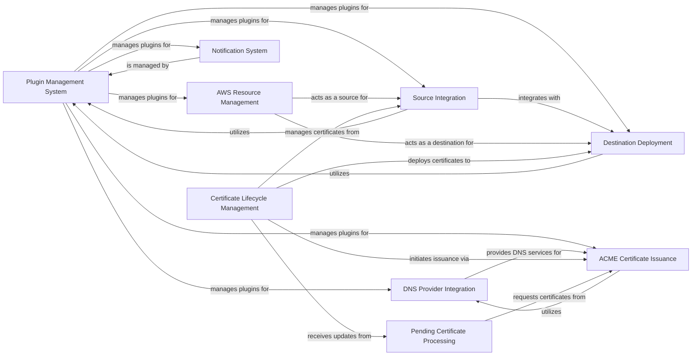

## Component Details

This component provides the core infrastructure for dynamically loading and managing various external integrations and plugins within Lemur. Its primary purpose is to enable Lemur to interact with external systems for certificate issuance (e.g., ACME), discovery (e.g., AWS ELB, S3), deployment (e.g., Kubernetes, SFTP, AWS), and DNS challenges. It acts as a flexible framework allowing new integrations to be added without modifying the core system.

### Plugin Management System
Manages the registration, retrieval, and interaction with various Lemur plugins, acting as a central hub for extending Lemur's functionality.

**Related Classes/Methods**:

- `lemur.plugins.base.manager` (full file reference)
- `lemur.plugins.base.v1` (full file reference)
- <a href="https://github.com/netflix/lemur/blob/master/lemur/plugins/base/manager.py#L14-L15" target="_blank" rel="noopener noreferrer">`lemur.plugins.base.manager.PluginManager:__iter__` (14:15)</a>
- <a href="https://github.com/netflix/lemur/blob/master/lemur/plugins/base/manager.py#L17-L18" target="_blank" rel="noopener noreferrer">`lemur.plugins.base.manager.PluginManager:__len__` (17:18)</a>
- <a href="https://github.com/netflix/lemur/blob/master/lemur/plugins/base/manager.py#L20-L30" target="_blank" rel="noopener noreferrer">`lemur.plugins.base.manager.PluginManager:all` (20:30)</a>
- <a href="https://github.com/netflix/lemur/blob/master/lemur/plugins/base/manager.py#L32-L44" target="_blank" rel="noopener noreferrer">`lemur.plugins.base.manager.PluginManager:get` (32:44)</a>
- <a href="https://github.com/netflix/lemur/blob/master/lemur/plugins/base/manager.py#L46-L63" target="_blank" rel="noopener noreferrer">`lemur.plugins.base.manager.PluginManager:first` (46:63)</a>
- <a href="https://github.com/netflix/lemur/blob/master/lemur/plugins/base/manager.py#L65-L67" target="_blank" rel="noopener noreferrer">`lemur.plugins.base.manager.PluginManager:register` (65:67)</a>
- <a href="https://github.com/netflix/lemur/blob/master/lemur/plugins/base/manager.py#L69-L71" target="_blank" rel="noopener noreferrer">`lemur.plugins.base.manager.PluginManager:unregister` (69:71)</a>
- <a href="https://github.com/netflix/lemur/blob/master/lemur/plugins/base/v1.py#L75-L81" target="_blank" rel="noopener noreferrer">`lemur.plugins.base.v1.IPlugin:get_conf_key` (75:81)</a>
- <a href="https://github.com/netflix/lemur/blob/master/lemur/plugins/base/v1.py#L83-L87" target="_blank" rel="noopener noreferrer">`lemur.plugins.base.v1.IPlugin:get_conf_title` (83:87)</a>
- <a href="https://github.com/netflix/lemur/blob/master/lemur/plugins/base/v1.py#L116-L125" target="_blank" rel="noopener noreferrer">`lemur.plugins.base.v1.IPlugin:get_option` (116:125)</a>
- <a href="https://github.com/netflix/lemur/blob/master/lemur/plugins/base/v1.py#L127-L145" target="_blank" rel="noopener noreferrer">`lemur.plugins.base.v1.IPlugin:validate_option_value` (127:145)</a>
- <a href="https://github.com/netflix/lemur/blob/master/lemur/plugins/base/v1.py#L17-L26" target="_blank" rel="noopener noreferrer">`lemur.plugins.base.v1.PluginMount` (17:26)</a>

### Source Integration
Manages the integration with external certificate sources, enabling synchronization and cleaning of certificates from these sources.

**Related Classes/Methods**:

- `lemur.sources` (full file reference)
- <a href="https://github.com/netflix/lemur/blob/master/lemur/sources/models.py#L29-L30" target="_blank" rel="noopener noreferrer">`lemur.sources.models.Source:plugin` (29:30)</a>
- <a href="https://github.com/netflix/lemur/blob/master/lemur/sources/service.py#L64-L71" target="_blank" rel="noopener noreferrer">`lemur.sources.service:sync_update_destination` (64:71)</a>
- <a href="https://github.com/netflix/lemur/blob/master/lemur/sources/service.py#L74-L183" target="_blank" rel="noopener noreferrer">`lemur.sources.service:sync_endpoints` (74:183)</a>
- <a href="https://github.com/netflix/lemur/blob/master/lemur/sources/service.py#L230-L284" target="_blank" rel="noopener noreferrer">`lemur.sources.service:sync_certificates` (230:284)</a>
- <a href="https://github.com/netflix/lemur/blob/master/lemur/sources/service.py#L422-L466" target="_blank" rel="noopener noreferrer">`lemur.sources.service:add_aws_destination_to_sources` (422:466)</a>
- <a href="https://github.com/netflix/lemur/blob/master/lemur/sources/cli.py#L126-L173" target="_blank" rel="noopener noreferrer">`lemur.sources.cli:sync` (126:173)</a>
- <a href="https://github.com/netflix/lemur/blob/master/lemur/sources/cli.py#L196-L231" target="_blank" rel="noopener noreferrer">`lemur.sources.cli:clean` (196:231)</a>
- <a href="https://github.com/netflix/lemur/blob/master/lemur/sources/cli.py#L262-L297" target="_blank" rel="noopener noreferrer">`lemur.sources.cli:clean_unused_and_expiring_within_days` (262:297)</a>
- <a href="https://github.com/netflix/lemur/blob/master/lemur/sources/cli.py#L328-L363" target="_blank" rel="noopener noreferrer">`lemur.sources.cli:clean_unused_and_issued_since_days` (328:363)</a>
- <a href="https://github.com/netflix/lemur/blob/master/lemur/sources/cli.py#L378-L393" target="_blank" rel="noopener noreferrer">`lemur.sources.cli:sync_source_destination` (378:393)</a>
- <a href="https://github.com/netflix/lemur/blob/master/lemur/sources/cli.py#L402-L450" target="_blank" rel="noopener noreferrer">`lemur.sources.cli:enable_cloudfront` (402:450)</a>
- <a href="https://github.com/netflix/lemur/blob/master/lemur/plugins/bases/source.py#L12-L41" target="_blank" rel="noopener noreferrer">`lemur.plugins.bases.source.SourcePlugin` (12:41)</a>

### Destination Deployment
Manages the deployment of certificates to various destinations, ensuring certificates are correctly placed and updated in target environments.

**Related Classes/Methods**:

- `lemur.destinations` (full file reference)
- <a href="https://github.com/netflix/lemur/blob/master/lemur/destinations/models.py#L25-L26" target="_blank" rel="noopener noreferrer">`lemur.destinations.models.Destination:plugin` (25:26)</a>
- <a href="https://github.com/netflix/lemur/blob/master/lemur/destinations/service.py#L20-L44" target="_blank" rel="noopener noreferrer">`lemur.destinations.service:create` (20:44)</a>
- <a href="https://github.com/netflix/lemur/blob/master/lemur/destinations/service.py#L47-L75" target="_blank" rel="noopener noreferrer">`lemur.destinations.service:update` (47:75)</a>
- <a href="https://github.com/netflix/lemur/blob/master/lemur/plugins/bases/destination.py#L12-L25" target="_blank" rel="noopener noreferrer">`lemur.plugins.bases.destination.DestinationPlugin` (12:25)</a>
- <a href="https://github.com/netflix/lemur/blob/master/lemur/plugins/bases/destination.py#L28-L61" target="_blank" rel="noopener noreferrer">`lemur.plugins.bases.destination.ExportDestinationPlugin` (28:61)</a>

### DNS Provider Integration
Provides an abstraction layer for interacting with various DNS providers to manage DNS records, primarily for ACME challenges.

**Related Classes/Methods**:

- `lemur.dns_providers` (full file reference)
- <a href="https://github.com/netflix/lemur/blob/master/lemur/dns_providers/models.py#L37-L38" target="_blank" rel="noopener noreferrer">`lemur.dns_providers.models.DnsProvider:plugin` (37:38)</a>
- <a href="https://github.com/netflix/lemur/blob/master/lemur/dns_providers/cli.py#L24-L50" target="_blank" rel="noopener noreferrer">`lemur.dns_providers.cli:get_all_zones` (24:50)</a>
- `lemur.plugins.lemur_acme.route53` (full file reference)
- `lemur.plugins.lemur_acme.nsone` (full file reference)
- `lemur.plugins.lemur_acme.powerdns` (full file reference)
- `lemur.plugins.lemur_acme.dyn` (full file reference)
- `lemur.plugins.lemur_acme.cloudflare` (full file reference)
- `lemur.plugins.lemur_acme.ultradns` (full file reference)
- <a href="https://github.com/netflix/lemur/blob/master/lemur/plugins/lemur_acme/acme_handlers.py#L299-L595" target="_blank" rel="noopener noreferrer">`lemur.plugins.lemur_acme.acme_handlers.AcmeDnsHandler` (299:595)</a>

### ACME Certificate Issuance
Provides functionality for issuing certificates using the ACME protocol, including handling DNS and HTTP challenges.

**Related Classes/Methods**:

- `lemur.plugins.lemur_acme.plugin` (full file reference)
- `lemur.plugins.lemur_acme.acme_handlers` (full file reference)
- `lemur.plugins.lemur_acme.challenge_types` (full file reference)
- <a href="https://github.com/netflix/lemur/blob/master/lemur/plugins/lemur_acme/plugin.py#L117-L167" target="_blank" rel="noopener noreferrer">`lemur.plugins.lemur_acme.plugin.ACMEIssuerPlugin:get_ordered_certificate` (117:167)</a>
- <a href="https://github.com/netflix/lemur/blob/master/lemur/plugins/lemur_acme/plugin.py#L169-L276" target="_blank" rel="noopener noreferrer">`lemur.plugins.lemur_acme.plugin.ACMEIssuerPlugin:get_ordered_certificates` (169:276)</a>
- <a href="https://github.com/netflix/lemur/blob/master/lemur/plugins/lemur_acme/plugin.py#L278-L288" target="_blank" rel="noopener noreferrer">`lemur.plugins.lemur_acme.plugin.ACMEIssuerPlugin:create_certificate` (278:288)</a>
- <a href="https://github.com/netflix/lemur/blob/master/lemur/plugins/lemur_acme/plugin.py#L291-L313" target="_blank" rel="noopener noreferrer">`lemur.plugins.lemur_acme.plugin.ACMEIssuerPlugin:create_authority` (291:313)</a>
- <a href="https://github.com/netflix/lemur/blob/master/lemur/plugins/lemur_acme/plugin.py#L319-L325" target="_blank" rel="noopener noreferrer">`lemur.plugins.lemur_acme.plugin.ACMEIssuerPlugin:revoke_certificate` (319:325)</a>
- <a href="https://github.com/netflix/lemur/blob/master/lemur/plugins/lemur_acme/plugin.py#L420-L430" target="_blank" rel="noopener noreferrer">`lemur.plugins.lemur_acme.plugin.ACMEHttpIssuerPlugin:create_certificate` (420:430)</a>
- <a href="https://github.com/netflix/lemur/blob/master/lemur/plugins/lemur_acme/plugin.py#L433-L455" target="_blank" rel="noopener noreferrer">`lemur.plugins.lemur_acme.plugin.ACMEHttpIssuerPlugin:create_authority` (433:455)</a>
- <a href="https://github.com/netflix/lemur/blob/master/lemur/plugins/lemur_acme/plugin.py#L461-L468" target="_blank" rel="noopener noreferrer">`lemur.plugins.lemur_acme.plugin.ACMEHttpIssuerPlugin:revoke_certificate` (461:468)</a>
- <a href="https://github.com/netflix/lemur/blob/master/lemur/plugins/lemur_acme/acme_handlers.py#L52-L73" target="_blank" rel="noopener noreferrer">`lemur.plugins.lemur_acme.acme_handlers.AcmeHandler:reuse_account` (52:73)</a>
- <a href="https://github.com/netflix/lemur/blob/master/lemur/plugins/lemur_acme/acme_handlers.py#L89-L126" target="_blank" rel="noopener noreferrer">`lemur.plugins.lemur_acme.acme_handlers.AcmeHandler:request_certificate` (89:126)</a>
- <a href="https://github.com/netflix/lemur/blob/master/lemur/plugins/lemur_acme/acme_handlers.py#L149-L150" target="_blank" rel="noopener noreferrer">`lemur.plugins.lemur_acme.acme_handlers.AcmeHandler:setup_acme_client` (149:150)</a>
- <a href="https://github.com/netflix/lemur/blob/master/lemur/plugins/lemur_acme/acme_handlers.py#L152-L241" target="_blank" rel="noopener noreferrer">`lemur.plugins.lemur_acme.acme_handlers.AcmeHandler:setup_acme_client_no_retry` (152:241)</a>
- <a href="https://github.com/netflix/lemur/blob/master/lemur/plugins/lemur_acme/acme_handlers.py#L262-L281" target="_blank" rel="noopener noreferrer">`lemur.plugins.lemur_acme.acme_handlers.AcmeHandler:revoke_certificate` (262:281)</a>
- <a href="https://github.com/netflix/lemur/blob/master/lemur/plugins/lemur_acme/acme_handlers.py#L283-L296" target="_blank" rel="noopener noreferrer">`lemur.plugins.lemur_acme.acme_handlers.AcmeHandler:log_remaining_validation` (283:296)</a>
- <a href="https://github.com/netflix/lemur/blob/master/lemur/plugins/lemur_acme/challenge_types.py#L76-L163" target="_blank" rel="noopener noreferrer">`lemur.plugins.lemur_acme.challenge_types.AcmeHttpChallenge:create_certificate` (76:163)</a>
- <a href="https://github.com/netflix/lemur/blob/master/lemur/plugins/lemur_acme/challenge_types.py#L165-L185" target="_blank" rel="noopener noreferrer">`lemur.plugins.lemur_acme.challenge_types.AcmeHttpChallenge:deploy` (165:185)</a>
- <a href="https://github.com/netflix/lemur/blob/master/lemur/plugins/lemur_acme/challenge_types.py#L187-L197" target="_blank" rel="noopener noreferrer">`lemur.plugins.lemur_acme.challenge_types.AcmeHttpChallenge:cleanup` (187:197)</a>
- <a href="https://github.com/netflix/lemur/blob/master/lemur/plugins/lemur_acme/challenge_types.py#L203-L263" target="_blank" rel="noopener noreferrer">`lemur.plugins.lemur_acme.challenge_types.AcmeDnsChallenge:create_certificate` (203:263)</a>
- <a href="https://github.com/netflix/lemur/blob/master/lemur/plugins/lemur_acme/challenge_types.py#L266-L293" target="_blank" rel="noopener noreferrer">`lemur.plugins.lemur_acme.challenge_types.AcmeDnsChallenge:create_certificate_immediately` (266:293)</a>
- <a href="https://github.com/netflix/lemur/blob/master/lemur/plugins/lemur_acme/challenge_types.py#L298-L309" target="_blank" rel="noopener noreferrer">`lemur.plugins.lemur_acme.challenge_types.AcmeDnsChallenge:cleanup` (298:309)</a>
- <a href="https://github.com/netflix/lemur/blob/master/lemur/plugins/bases/issuer.py#L12-L36" target="_blank" rel="noopener noreferrer">`lemur.plugins.bases.issuer.IssuerPlugin` (12:36)</a>

### AWS Resource Management
Integrates with Amazon Web Services (AWS) to manage certificates in IAM, S3, ELB, CloudFront, and ACM, supporting both source and destination functionalities.

**Related Classes/Methods**:

- `lemur.plugins.lemur_aws.plugin` (full file reference)
- `lemur.plugins.lemur_aws.acm` (full file reference)
- `lemur.plugins.lemur_aws.cloudfront` (full file reference)
- `lemur.plugins.lemur_aws.ec2` (full file reference)
- `lemur.plugins.lemur_aws.elb` (full file reference)
- `lemur.plugins.lemur_aws.iam` (full file reference)
- `lemur.plugins.lemur_aws.s3` (full file reference)
- `lemur.plugins.lemur_aws.sns` (full file reference)
- <a href="https://github.com/netflix/lemur/blob/master/lemur/plugins/lemur_aws/plugin.py#L276-L288" target="_blank" rel="noopener noreferrer">`lemur.plugins.lemur_aws.plugin.AWSSourcePlugin:get_certificates` (276:288)</a>
- <a href="https://github.com/netflix/lemur/blob/master/lemur/plugins/lemur_aws/plugin.py#L290-L297" target="_blank" rel="noopener noreferrer">`lemur.plugins.lemur_aws.plugin.AWSSourcePlugin:get_endpoints` (290:297)</a>
- <a href="https://github.com/netflix/lemur/blob/master/lemur/plugins/lemur_aws/plugin.py#L299-L340" target="_blank" rel="noopener noreferrer">`lemur.plugins.lemur_aws.plugin.AWSSourcePlugin:get_load_balancers` (299:340)</a>
- <a href="https://github.com/netflix/lemur/blob/master/lemur/plugins/lemur_aws/plugin.py#L342-L366" target="_blank" rel="noopener noreferrer">`lemur.plugins.lemur_aws.plugin.AWSSourcePlugin:get_distributions` (342:366)</a>
- <a href="https://github.com/netflix/lemur/blob/master/lemur/plugins/lemur_aws/plugin.py#L368-L422" target="_blank" rel="noopener noreferrer">`lemur.plugins.lemur_aws.plugin.AWSSourcePlugin:update_endpoint` (368:422)</a>
- <a href="https://github.com/netflix/lemur/blob/master/lemur/plugins/lemur_aws/plugin.py#L424-L426" target="_blank" rel="noopener noreferrer">`lemur.plugins.lemur_aws.plugin.AWSSourcePlugin:clean` (424:426)</a>
- <a href="https://github.com/netflix/lemur/blob/master/lemur/plugins/lemur_aws/plugin.py#L428-L449" target="_blank" rel="noopener noreferrer">`lemur.plugins.lemur_aws.plugin.AWSSourcePlugin:get_certificate_by_name` (428:449)</a>
- <a href="https://github.com/netflix/lemur/blob/master/lemur/plugins/lemur_aws/plugin.py#L451-L492" target="_blank" rel="noopener noreferrer">`lemur.plugins.lemur_aws.plugin.AWSSourcePlugin:get_endpoint_certificate_names` (451:492)</a>
- <a href="https://github.com/netflix/lemur/blob/master/lemur/plugins/lemur_aws/plugin.py#L523-L534" target="_blank" rel="noopener noreferrer">`lemur.plugins.lemur_aws.plugin.AWSDestinationPlugin:upload` (523:534)</a>
- <a href="https://github.com/netflix/lemur/blob/master/lemur/plugins/lemur_aws/plugin.py#L539-L541" target="_blank" rel="noopener noreferrer">`lemur.plugins.lemur_aws.plugin.AWSDestinationPlugin:clean` (539:541)</a>
- <a href="https://github.com/netflix/lemur/blob/master/lemur/plugins/lemur_aws/plugin.py#L595-L617" target="_blank" rel="noopener noreferrer">`lemur.plugins.lemur_aws.plugin.S3DestinationPlugin:upload` (595:617)</a>
- <a href="https://github.com/netflix/lemur/blob/master/lemur/plugins/lemur_aws/plugin.py#L622-L663" target="_blank" rel="noopener noreferrer">`lemur.plugins.lemur_aws.plugin.S3DestinationPlugin:upload_acme_token` (622:663)</a>
- <a href="https://github.com/netflix/lemur/blob/master/lemur/plugins/lemur_aws/plugin.py#L665-L690" target="_blank" rel="noopener noreferrer">`lemur.plugins.lemur_aws.plugin.S3DestinationPlugin:delete_acme_token` (665:690)</a>
- <a href="https://github.com/netflix/lemur/blob/master/lemur/plugins/lemur_aws/plugin.py#L692-L710" target="_blank" rel="noopener noreferrer">`lemur.plugins.lemur_aws.plugin.S3DestinationPlugin:clean` (692:710)</a>
- <a href="https://github.com/netflix/lemur/blob/master/lemur/plugins/lemur_aws/plugin.py#L747-L758" target="_blank" rel="noopener noreferrer">`lemur.plugins.lemur_aws.plugin.SNSNotificationPlugin:send` (747:758)</a>
- <a href="https://github.com/netflix/lemur/blob/master/lemur/plugins/lemur_aws/plugin.py#L784-L797" target="_blank" rel="noopener noreferrer">`lemur.plugins.lemur_aws.plugin.AWSACMSourcePlugin:get_certificates` (784:797)</a>
- <a href="https://github.com/netflix/lemur/blob/master/lemur/plugins/lemur_aws/plugin.py#L826-L836" target="_blank" rel="noopener noreferrer">`lemur.plugins.lemur_aws.plugin.ACMDestinationPlugin:upload` (826:836)</a>
- <a href="https://github.com/netflix/lemur/blob/master/lemur/plugins/lemur_aws/plugin.py#L838-L840" target="_blank" rel="noopener noreferrer">`lemur.plugins.lemur_aws.plugin.ACMDestinationPlugin:clean` (838:840)</a>
- <a href="https://github.com/netflix/lemur/blob/master/lemur/plugins/lemur_aws/cloudfront.py#L17-L45" target="_blank" rel="noopener noreferrer">`lemur.plugins.lemur_aws.cloudfront:get_all_distributions` (17:45)</a>
- <a href="https://github.com/netflix/lemur/blob/master/lemur/plugins/lemur_aws/cloudfront.py#L48-L90" target="_blank" rel="noopener noreferrer">`lemur.plugins.lemur_aws.cloudfront:_filter_ignored_distributions` (48:90)</a>
- <a href="https://github.com/netflix/lemur/blob/master/lemur/plugins/lemur_aws/cloudfront.py#L93-L106" target="_blank" rel="noopener noreferrer">`lemur.plugins.lemur_aws.cloudfront:get_distributions` (93:106)</a>
- <a href="https://github.com/netflix/lemur/blob/master/lemur/plugins/lemur_aws/cloudfront.py#L110-L133" target="_blank" rel="noopener noreferrer">`lemur.plugins.lemur_aws.cloudfront:get_distribution` (110:133)</a>
- <a href="https://github.com/netflix/lemur/blob/master/lemur/plugins/lemur_aws/cloudfront.py#L137-L172" target="_blank" rel="noopener noreferrer">`lemur.plugins.lemur_aws.cloudfront:attach_certificate` (137:172)</a>
- <a href="https://github.com/netflix/lemur/blob/master/lemur/plugins/lemur_aws/elb.py#L19-L40" target="_blank" rel="noopener noreferrer">`lemur.plugins.lemur_aws.elb:retry_throttled` (19:40)</a>
- <a href="https://github.com/netflix/lemur/blob/master/lemur/plugins/lemur_aws/elb.py#L67-L87" target="_blank" rel="noopener noreferrer">`lemur.plugins.lemur_aws.elb:get_all_elbs` (67:87)</a>
- <a href="https://github.com/netflix/lemur/blob/master/lemur/plugins/lemur_aws/elb.py#L90-L97" target="_blank" rel="noopener noreferrer">`lemur.plugins.lemur_aws.elb:_filter_ignored_elbsv1` (90:97)</a>
- <a href="https://github.com/netflix/lemur/blob/master/lemur/plugins/lemur_aws/elb.py#L100-L107" target="_blank" rel="noopener noreferrer">`lemur.plugins.lemur_aws.elb:_filter_ignored_elbsv2` (100:107)</a>
- <a href="https://github.com/netflix/lemur/blob/master/lemur/plugins/lemur_aws/elb.py#L110-L151" target="_blank" rel="noopener noreferrer">`lemur.plugins.lemur_aws.elb:_filter_ignored_elbs` (110:151)</a>
- <a href="https://github.com/netflix/lemur/blob/master/lemur/plugins/lemur_aws/elb.py#L155-L176" target="_blank" rel="noopener noreferrer">`lemur.plugins.lemur_aws.elb:get_all_elbs_v2` (155:176)</a>
- <a href="https://github.com/netflix/lemur/blob/master/lemur/plugins/lemur_aws/elb.py#L181-L215" target="_blank" rel="noopener noreferrer">`lemur.plugins.lemur_aws.elb:get_listener_arn_from_endpoint` (181:215)</a>
- <a href="https://github.com/netflix/lemur/blob/master/lemur/plugins/lemur_aws/elb.py#L220-L247" target="_blank" rel="noopener noreferrer">`lemur.plugins.lemur_aws.elb:get_load_balancer_arn_from_endpoint` (220:247)</a>
- <a href="https://github.com/netflix/lemur/blob/master/lemur/plugins/lemur_aws/elb.py#L251-L255" target="_blank" rel="noopener noreferrer">`lemur.plugins.lemur_aws.elb:get_elbs` (251:255)</a>
- <a href="https://github.com/netflix/lemur/blob/master/lemur/plugins/lemur_aws/elb.py#L259-L269" target="_blank" rel="noopener noreferrer">`lemur.plugins.lemur_aws.elb:_get_elbs` (259:269)</a>
- <a href="https://github.com/netflix/lemur/blob/master/lemur/plugins/lemur_aws/elb.py#L273-L280" target="_blank" rel="noopener noreferrer">`lemur.plugins.lemur_aws.elb:get_elbs_v2` (273:280)</a>
- <a href="https://github.com/netflix/lemur/blob/master/lemur/plugins/lemur_aws/elb.py#L284-L297" target="_blank" rel="noopener noreferrer">`lemur.plugins.lemur_aws.elb:_get_elbs_v2` (284:297)</a>
- <a href="https://github.com/netflix/lemur/blob/master/lemur/plugins/lemur_aws/elb.py#L302-L317" target="_blank" rel="noopener noreferrer">`lemur.plugins.lemur_aws.elb:describe_listeners_v2` (302:317)</a>
- <a href="https://github.com/netflix/lemur/blob/master/lemur/plugins/lemur_aws/elb.py#L322-L351" target="_blank" rel="noopener noreferrer">`lemur.plugins.lemur_aws.elb:describe_load_balancer_policies` (322:351)</a>
- <a href="https://github.com/netflix/lemur/blob/master/lemur/plugins/lemur_aws/elb.py#L356-L373" target="_blank" rel="noopener noreferrer">`lemur.plugins.lemur_aws.elb:describe_ssl_policies_v2` (356:373)</a>
- <a href="https://github.com/netflix/lemur/blob/master/lemur/plugins/lemur_aws/elb.py#L378-L387" target="_blank" rel="noopener noreferrer">`lemur.plugins.lemur_aws.elb:describe_load_balancer_types` (378:387)</a>
- <a href="https://github.com/netflix/lemur/blob/master/lemur/plugins/lemur_aws/elb.py#L392-L411" target="_blank" rel="noopener noreferrer">`lemur.plugins.lemur_aws.elb:attach_certificate` (392:411)</a>
- <a href="https://github.com/netflix/lemur/blob/master/lemur/plugins/lemur_aws/elb.py#L416-L443" target="_blank" rel="noopener noreferrer">`lemur.plugins.lemur_aws.elb:attach_certificate_v2` (416:443)</a>
- <a href="https://github.com/netflix/lemur/blob/master/lemur/plugins/lemur_aws/elb.py#L446-L489" target="_blank" rel="noopener noreferrer">`lemur.plugins.lemur_aws.elb:has_listener_cert_for_sni` (446:489)</a>
- <a href="https://github.com/netflix/lemur/blob/master/lemur/plugins/lemur_aws/acm.py#L18-L35" target="_blank" rel="noopener noreferrer">`lemur.plugins.lemur_aws.acm:retry_throttled` (18:35)</a>
- <a href="https://github.com/netflix/lemur/blob/master/lemur/plugins/lemur_aws/acm.py#L53-L81" target="_blank" rel="noopener noreferrer">`lemur.plugins.lemur_aws.acm:upload_cert` (53:81)</a>
- <a href="https://github.com/netflix/lemur/blob/master/lemur/plugins/lemur_aws/acm.py#L86-L99" target="_blank" rel="noopener noreferrer">`lemur.plugins.lemur_aws.acm:delete_cert` (86:99)</a>
- <a href="https://github.com/netflix/lemur/blob/master/lemur/plugins/lemur_aws/acm.py#L103-L109" target="_blank" rel="noopener noreferrer">`lemur.plugins.lemur_aws.acm:get_certificate` (103:109)</a>
- <a href="https://github.com/netflix/lemur/blob/master/lemur/plugins/lemur_aws/acm.py#L113-L120" target="_blank" rel="noopener noreferrer">`lemur.plugins.lemur_aws.acm:_get_certificate` (113:120)</a>
- <a href="https://github.com/netflix/lemur/blob/master/lemur/plugins/lemur_aws/acm.py#L124-L130" target="_blank" rel="noopener noreferrer">`lemur.plugins.lemur_aws.acm:get_certificates` (124:130)</a>
- <a href="https://github.com/netflix/lemur/blob/master/lemur/plugins/lemur_aws/acm.py#L134-L141" target="_blank" rel="noopener noreferrer">`lemur.plugins.lemur_aws.acm:_get_certificates` (134:141)</a>
- <a href="https://github.com/netflix/lemur/blob/master/lemur/plugins/lemur_aws/acm.py#L145-L181" target="_blank" rel="noopener noreferrer">`lemur.plugins.lemur_aws.acm:get_all_certificates` (145:181)</a>
- <a href="https://github.com/netflix/lemur/blob/master/lemur/plugins/lemur_aws/s3.py#L17-L43" target="_blank" rel="noopener noreferrer">`lemur.plugins.lemur_aws.s3:put` (17:43)</a>
- <a href="https://github.com/netflix/lemur/blob/master/lemur/plugins/lemur_aws/s3.py#L47-L60" target="_blank" rel="noopener noreferrer">`lemur.plugins.lemur_aws.s3:delete` (47:60)</a>
- <a href="https://github.com/netflix/lemur/blob/master/lemur/plugins/lemur_aws/s3.py#L64-L75" target="_blank" rel="noopener noreferrer">`lemur.plugins.lemur_aws.s3:get` (64:75)</a>
- <a href="https://github.com/netflix/lemur/blob/master/lemur/plugins/lemur_aws/iam.py#L19-L36" target="_blank" rel="noopener noreferrer">`lemur.plugins.lemur_aws.iam:retry_throttled` (19:36)</a>
- <a href="https://github.com/netflix/lemur/blob/master/lemur/plugins/lemur_aws/iam.py#L113-L151" target="_blank" rel="noopener noreferrer">`lemur.plugins.lemur_aws.iam:upload_cert` (113:151)</a>
- <a href="https://github.com/netflix/lemur/blob/master/lemur/plugins/lemur_aws/iam.py#L156-L169" target="_blank" rel="noopener noreferrer">`lemur.plugins.lemur_aws.iam:delete_cert` (156:169)</a>
- <a href="https://github.com/netflix/lemur/blob/master/lemur/plugins/lemur_aws/iam.py#L173-L179" target="_blank" rel="noopener noreferrer">`lemur.plugins.lemur_aws.iam:get_certificate` (173:179)</a>
- <a href="https://github.com/netflix/lemur/blob/master/lemur/plugins/lemur_aws/iam.py#L183-L190" target="_blank" rel="noopener noreferrer">`lemur.plugins.lemur_aws.iam:_get_certificate` (183:190)</a>
- <a href="https://github.com/netflix/lemur/blob/master/lemur/plugins/lemur_aws/iam.py#L194-L200" target="_blank" rel="noopener noreferrer">`lemur.plugins.lemur_aws.iam:get_certificates` (194:200)</a>
- <a href="https://github.com/netflix/lemur/blob/master/lemur/plugins/lemur_aws/iam.py#L204-L206" target="_blank" rel="noopener noreferrer">`lemur.plugins.lemur_aws.iam:_get_certificates` (204:206)</a>
- <a href="https://github.com/netflix/lemur/blob/master/lemur/plugins/lemur_aws/iam.py#L210-L241" target="_blank" rel="noopener noreferrer">`lemur.plugins.lemur_aws.iam:get_all_certificates` (210:241)</a>
- <a href="https://github.com/netflix/lemur/blob/master/lemur/plugins/lemur_aws/iam.py#L244-L267" target="_blank" rel="noopener noreferrer">`lemur.plugins.lemur_aws.iam:get_certificate_id_to_name` (244:267)</a>
- <a href="https://github.com/netflix/lemur/blob/master/lemur/plugins/lemur_aws/iam.py#L270-L319" target="_blank" rel="noopener noreferrer">`lemur.plugins.lemur_aws.iam:_filter_ignored_certificates` (270:319)</a>
- <a href="https://github.com/netflix/lemur/blob/master/lemur/plugins/lemur_aws/sns.py#L17-L25" target="_blank" rel="noopener noreferrer">`lemur.plugins.lemur_aws.sns:publish` (17:25)</a>
- <a href="https://github.com/netflix/lemur/blob/master/lemur/plugins/lemur_aws/sns.py#L28-L43" target="_blank" rel="noopener noreferrer">`lemur.plugins.lemur_aws.sns:publish_single` (28:43)</a>
- <a href="https://github.com/netflix/lemur/blob/master/lemur/plugins/lemur_aws/sns.py#L52-L65" target="_blank" rel="noopener noreferrer">`lemur.plugins.lemur_aws.sns:format_message` (52:65)</a>
- <a href="https://github.com/netflix/lemur/blob/master/lemur/plugins/lemur_aws/sns.py#L68-L78" target="_blank" rel="noopener noreferrer">`lemur.plugins.lemur_aws.sns:calculate_expiration_days` (68:78)</a>
- <a href="https://github.com/netflix/lemur/blob/master/lemur/plugins/lemur_aws/sts.py#L19-L63" target="_blank" rel="noopener noreferrer">`lemur.plugins.lemur_aws.sts.sts_client` (19:63)</a>

### Certificate Lifecycle Management
Responsible for the core operations related to certificates, including creation, export, revocation, deactivation, and managing associations with sources and destinations.

**Related Classes/Methods**:

- <a href="https://github.com/netflix/lemur/blob/master/lemur/certificates/models.py#L466-L503" target="_blank" rel="noopener noreferrer">`lemur.certificates.models:update_destinations` (466:503)</a>
- <a href="https://github.com/netflix/lemur/blob/master/lemur/certificates/service.py#L354-L366" target="_blank" rel="noopener noreferrer">`lemur.certificates.service:export` (354:366)</a>
- <a href="https://github.com/netflix/lemur/blob/master/lemur/certificates/service.py#L436-L456" target="_blank" rel="noopener noreferrer">`lemur.certificates.service:mint` (436:456)</a>
- <a href="https://github.com/netflix/lemur/blob/master/lemur/certificates/service.py#L577-L589" target="_blank" rel="noopener noreferrer">`lemur.certificates.service:validate_no_duplicate_destinations` (577:589)</a>
- `lemur.certificates.service:remove_from_destination` (full file reference)
- `lemur.certificates.service:deactivate` (full file reference)
- `lemur.certificates.service:revoke` (full file reference)
- `lemur.certificates.service:remove_destination_association` (full file reference)
- `lemur.certificates.cli:clear_pending` (full file reference)
- `lemur.certificates.cli:deactivate_entrust_certificates` (full file reference)

### Pending Certificate Processing
Handles the lifecycle of certificates that are in a pending state, including fetching, uploading, and managing attempts for issuance.

**Related Classes/Methods**:

- <a href="https://github.com/netflix/lemur/blob/master/lemur/pending_certificates/service.py#L180-L194" target="_blank" rel="noopener noreferrer">`lemur.pending_certificates.service:cancel` (180:194)</a>
- <a href="https://github.com/netflix/lemur/blob/master/lemur/pending_certificates/service.py#L287-L319" target="_blank" rel="noopener noreferrer">`lemur.pending_certificates.service:upload` (287:319)</a>
- <a href="https://github.com/netflix/lemur/blob/master/lemur/pending_certificates/cli.py#L39-L70" target="_blank" rel="noopener noreferrer">`lemur.pending_certificates.cli:fetch` (39:70)</a>
- <a href="https://github.com/netflix/lemur/blob/master/lemur/pending_certificates/cli.py#L78-L150" target="_blank" rel="noopener noreferrer">`lemur.pending_certificates.cli:fetch_all_acme` (78:150)</a>

### Notification System
Handles sending various types of notifications related to certificate events, such as expiration or rotation, through different channels like email or Slack.

**Related Classes/Methods**:

- <a href="https://github.com/netflix/lemur/blob/master/lemur/notifications/messaging.py#L338-L380" target="_blank" rel="noopener noreferrer">`lemur.notifications.messaging:send_default_notification` (338:380)</a>
- <a href="https://github.com/netflix/lemur/blob/master/lemur/notifications/messaging.py#L460-L496" target="_blank" rel="noopener noreferrer">`lemur.notifications.messaging:needs_notification` (460:496)</a>
- <a href="https://github.com/netflix/lemur/blob/master/lemur/notifications/models.py#L44-L45" target="_blank" rel="noopener noreferrer">`lemur.notifications.models.Notification:plugin` (44:45)</a>
- `lemur.plugins.lemur_email.plugin:__init__` (full file reference)
- `lemur.plugins.lemur_email.plugin:send` (full file reference)
- `lemur.plugins.lemur_email.plugin:get_recipients` (full file reference)
- <a href="https://github.com/netflix/lemur/blob/master/lemur/plugins/lemur_email/templates/config.py#L18-L19" target="_blank" rel="noopener noreferrer">`lemur.plugins.lemur_email.templates.config:interval` (18:19)</a>
- <a href="https://github.com/netflix/lemur/blob/master/lemur/plugins/lemur_email/templates/config.py#L22-L23" target="_blank" rel="noopener noreferrer">`lemur.plugins.lemur_email.templates.config:unit` (22:23)</a>
- <a href="https://github.com/netflix/lemur/blob/master/lemur/plugins/lemur_slack/plugin.py#L26-L54" target="_blank" rel="noopener noreferrer">`lemur.plugins.lemur_slack.plugin:create_expiration_attachments` (26:54)</a>
- <a href="https://github.com/netflix/lemur/blob/master/lemur/plugins/lemur_slack/plugin.py#L57-L76" target="_blank" rel="noopener noreferrer">`lemur.plugins.lemur_slack.plugin:create_rotation_attachments` (57:76)</a>
- <a href="https://github.com/netflix/lemur/blob/master/lemur/plugins/lemur_slack/plugin.py#L112-L144" target="_blank" rel="noopener noreferrer">`lemur.plugins.lemur_slack.plugin.SlackNotificationPlugin:send` (112:144)</a>

### [FAQ](https://github.com/CodeBoarding/GeneratedOnBoardings/tree/main?tab=readme-ov-file#faq)