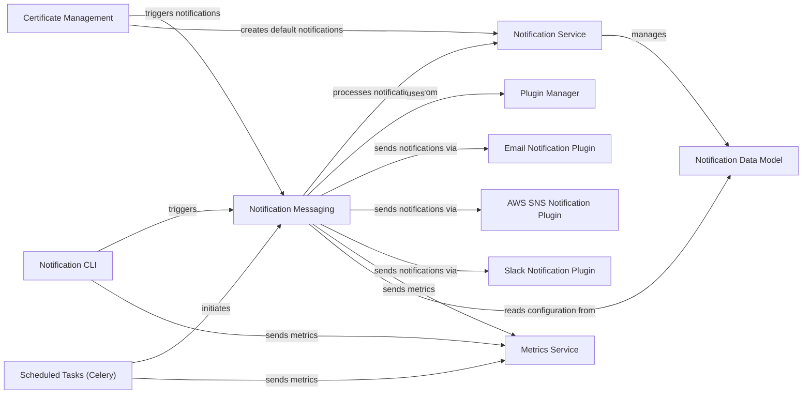

## Component Details

The 'Notification & Alerting' component in Lemur is dedicated to managing and delivering various notifications and alerts. It handles the creation, update, and dispatch of messages, particularly for critical events like certificate expirations, rotations, and operational failures, by leveraging configured notification plugins. This component integrates with scheduled tasks for automated notifications and provides CLI functionalities for manual triggering.

### Notification Service
This component manages the lifecycle of notification configurations within Lemur, including creation, retrieval, update, and deletion. It also handles the creation of default expiration notifications for certificates.

**Related Classes/Methods**:

- <a href="https://github.com/netflix/lemur/blob/master/lemur/notifications/service.py#L1-L170" target="_blank" rel="noopener noreferrer">`lemur.lemur.notifications.service` (1:170)</a>
- <a href="https://github.com/netflix/lemur/blob/master/lemur/notifications/service.py#L21-L87" target="_blank" rel="noopener noreferrer">`lemur.lemur.notifications.service.create_default_expiration_notifications` (21:87)</a>
- <a href="https://github.com/netflix/lemur/blob/master/lemur/notifications/service.py#L90-L106" target="_blank" rel="noopener noreferrer">`lemur.lemur.notifications.service.create` (90:106)</a>
- <a href="https://github.com/netflix/lemur/blob/master/lemur/notifications/service.py#L109-L134" target="_blank" rel="noopener noreferrer">`lemur.lemur.notifications.service.update` (109:134)</a>
- <a href="https://github.com/netflix/lemur/blob/master/lemur/notifications/service.py#L137-L146" target="_blank" rel="noopener noreferrer">`lemur.lemur.notifications.service.delete` (137:146)</a>
- <a href="https://github.com/netflix/lemur/blob/master/lemur/notifications/service.py#L149-L157" target="_blank" rel="noopener noreferrer">`lemur.lemur.notifications.service.get` (149:157)</a>
- <a href="https://github.com/netflix/lemur/blob/master/lemur/notifications/service.py#L160-L167" target="_blank" rel="noopener noreferrer">`lemur.lemur.notifications.service.get_by_label` (160:167)</a>
- <a href="https://github.com/netflix/lemur/blob/master/lemur/notifications/service.py#L170-L177" target="_blank" rel="noopener noreferrer">`lemur.lemur.notifications.service.get_all` (170:177)</a>
- <a href="https://github.com/netflix/lemur/blob/master/lemur/notifications/service.py#L180-L199" target="_blank" rel="noopener noreferrer">`lemur.lemur.notifications.service.render` (180:199)</a>

### Notification Messaging
This component is responsible for the actual dispatch of various types of notifications (expiration, authority expiration, security summary, revocation, rotation, pending certificate failure). It queries for eligible certificates and dispatches notifications through configured plugins.

**Related Classes/Methods**:

- <a href="https://github.com/netflix/lemur/blob/master/lemur/notifications/messaging.py#L1-L440" target="_blank" rel="noopener noreferrer">`lemur.lemur.notifications.messaging` (1:440)</a>
- <a href="https://github.com/netflix/lemur/blob/master/lemur/notifications/messaging.py#L34-L64" target="_blank" rel="noopener noreferrer">`lemur.lemur.notifications.messaging.get_certificates` (34:64)</a>
- <a href="https://github.com/netflix/lemur/blob/master/lemur/notifications/messaging.py#L67-L97" target="_blank" rel="noopener noreferrer">`lemur.lemur.notifications.messaging.get_certificates_for_security_summary_email` (67:97)</a>
- <a href="https://github.com/netflix/lemur/blob/master/lemur/notifications/messaging.py#L100-L125" target="_blank" rel="noopener noreferrer">`lemur.lemur.notifications.messaging.get_expiring_authority_certificates` (100:125)</a>
- <a href="https://github.com/netflix/lemur/blob/master/lemur/notifications/messaging.py#L128-L153" target="_blank" rel="noopener noreferrer">`lemur.lemur.notifications.messaging.get_eligible_certificates` (128:153)</a>
- <a href="https://github.com/netflix/lemur/blob/master/lemur/notifications/messaging.py#L156-L170" target="_blank" rel="noopener noreferrer">`lemur.lemur.notifications.messaging.get_eligible_security_summary_certs` (156:170)</a>
- <a href="https://github.com/netflix/lemur/blob/master/lemur/notifications/messaging.py#L173-L190" target="_blank" rel="noopener noreferrer">`lemur.lemur.notifications.messaging.get_eligible_authority_certificates` (173:190)</a>
- <a href="https://github.com/netflix/lemur/blob/master/lemur/notifications/messaging.py#L193-L231" target="_blank" rel="noopener noreferrer">`lemur.lemur.notifications.messaging.send_plugin_notification` (193:231)</a>
- <a href="https://github.com/netflix/lemur/blob/master/lemur/notifications/messaging.py#L234-L298" target="_blank" rel="noopener noreferrer">`lemur.lemur.notifications.messaging.send_expiration_notifications` (234:298)</a>
- <a href="https://github.com/netflix/lemur/blob/master/lemur/notifications/messaging.py#L301-L335" target="_blank" rel="noopener noreferrer">`lemur.lemur.notifications.messaging.send_authority_expiration_notifications` (301:335)</a>
- <a href="https://github.com/netflix/lemur/blob/master/lemur/notifications/messaging.py#L338-L380" target="_blank" rel="noopener noreferrer">`lemur.lemur.notifications.messaging.send_default_notification` (338:380)</a>
- <a href="https://github.com/netflix/lemur/blob/master/lemur/notifications/messaging.py#L383-L387" target="_blank" rel="noopener noreferrer">`lemur.lemur.notifications.messaging.send_revocation_notification` (383:387)</a>
- <a href="https://github.com/netflix/lemur/blob/master/lemur/notifications/messaging.py#L390-L394" target="_blank" rel="noopener noreferrer">`lemur.lemur.notifications.messaging.send_rotation_notification` (390:394)</a>
- <a href="https://github.com/netflix/lemur/blob/master/lemur/notifications/messaging.py#L397-L417" target="_blank" rel="noopener noreferrer">`lemur.lemur.notifications.messaging.send_reissue_no_endpoints_notification` (397:417)</a>
- <a href="https://github.com/netflix/lemur/blob/master/lemur/notifications/messaging.py#L420-L430" target="_blank" rel="noopener noreferrer">`lemur.lemur.notifications.messaging.send_reissue_failed_notification` (420:430)</a>
- <a href="https://github.com/netflix/lemur/blob/master/lemur/notifications/messaging.py#L433-L457" target="_blank" rel="noopener noreferrer">`lemur.lemur.notifications.messaging.send_pending_failure_notification` (433:457)</a>
- <a href="https://github.com/netflix/lemur/blob/master/lemur/notifications/messaging.py#L460-L496" target="_blank" rel="noopener noreferrer">`lemur.lemur.notifications.messaging.needs_notification` (460:496)</a>
- <a href="https://github.com/netflix/lemur/blob/master/lemur/notifications/messaging.py#L499-L510" target="_blank" rel="noopener noreferrer">`lemur.lemur.notifications.messaging.send_security_expiration_summary` (499:510)</a>
- <a href="https://github.com/netflix/lemur/blob/master/lemur/notifications/messaging.py#L513-L540" target="_blank" rel="noopener noreferrer">`lemur.lemur.notifications.messaging.send_expiring_deployed_certificate_notifications` (513:540)</a>

### Notification CLI
This component provides command-line interface (CLI) functionalities for triggering various notification processes, such as sending expiration notifications, authority expiration notifications, security expiration summaries, and notifications for expiring deployed certificates.

**Related Classes/Methods**:

- <a href="https://github.com/netflix/lemur/blob/master/lemur/notifications/cli.py#L24-L25" target="_blank" rel="noopener noreferrer">`lemur.lemur.notifications.cli` (24:25)</a>
- <a href="https://github.com/netflix/lemur/blob/master/lemur/notifications/cli.py#L45-L46" target="_blank" rel="noopener noreferrer">`lemur.lemur.notifications.cli.expirations_command` (45:46)</a>
- <a href="https://github.com/netflix/lemur/blob/master/lemur/notifications/cli.py#L49-L75" target="_blank" rel="noopener noreferrer">`lemur.lemur.notifications.cli.expirations` (49:75)</a>
- <a href="https://github.com/netflix/lemur/blob/master/lemur/notifications/cli.py#L78-L99" target="_blank" rel="noopener noreferrer">`lemur.lemur.notifications.cli.authority_expirations` (78:99)</a>
- <a href="https://github.com/netflix/lemur/blob/master/lemur/notifications/cli.py#L102-L122" target="_blank" rel="noopener noreferrer">`lemur.lemur.notifications.cli.security_expiration_summary` (102:122)</a>
- <a href="https://github.com/netflix/lemur/blob/master/lemur/notifications/cli.py#L125-L146" target="_blank" rel="noopener noreferrer">`lemur.lemur.notifications.cli.notify_expiring_deployed_certificates` (125:146)</a>

### Email Notification Plugin
This plugin is responsible for sending notifications via email. It handles rendering HTML templates and dispatching emails through configured services like SES or SMTP.

**Related Classes/Methods**:

- <a href="https://github.com/netflix/lemur/blob/master/lemur/plugins/lemur_email/plugin.py#L113-L167" target="_blank" rel="noopener noreferrer">`lemur.lemur.plugins.lemur_email.plugin.EmailNotificationPlugin` (113:167)</a>
- <a href="https://github.com/netflix/lemur/blob/master/lemur/plugins/lemur_email/plugin.py#L26-L39" target="_blank" rel="noopener noreferrer">`lemur.lemur.plugins.lemur_email.plugin.render_html` (26:39)</a>
- <a href="https://github.com/netflix/lemur/blob/master/lemur/plugins/lemur_email/plugin.py#L42-L56" target="_blank" rel="noopener noreferrer">`lemur.lemur.plugins.lemur_email.plugin.send_via_smtp` (42:56)</a>
- <a href="https://github.com/netflix/lemur/blob/master/lemur/plugins/lemur_email/plugin.py#L59-L95" target="_blank" rel="noopener noreferrer">`lemur.lemur.plugins.lemur_email.plugin.send_via_ses` (59:95)</a>
- <a href="https://github.com/netflix/lemur/blob/master/lemur/plugins/lemur_email/plugin.py#L98-L110" target="_blank" rel="noopener noreferrer">`lemur.lemur.plugins.lemur_email.plugin.TitleParser` (98:110)</a>

### AWS SNS Notification Plugin
This plugin facilitates sending notifications through Amazon Simple Notification Service (SNS). It formats messages and publishes them to specified SNS topics.

**Related Classes/Methods**:

- <a href="https://github.com/netflix/lemur/blob/master/lemur/plugins/lemur_aws/plugin.py#L713-L758" target="_blank" rel="noopener noreferrer">`lemur.lemur.plugins.lemur_aws.plugin.SNSNotificationPlugin` (713:758)</a>
- <a href="https://github.com/netflix/lemur/blob/master/lemur/plugins/lemur_aws/sns.py#L17-L25" target="_blank" rel="noopener noreferrer">`lemur.lemur.plugins.lemur_aws.sns.publish` (17:25)</a>
- <a href="https://github.com/netflix/lemur/blob/master/lemur/plugins/lemur_aws/sns.py#L28-L43" target="_blank" rel="noopener noreferrer">`lemur.lemur.plugins.lemur_aws.sns.publish_single` (28:43)</a>
- <a href="https://github.com/netflix/lemur/blob/master/lemur/plugins/lemur_aws/sns.py#L52-L65" target="_blank" rel="noopener noreferrer">`lemur.lemur.plugins.lemur_aws.sns.format_message` (52:65)</a>
- <a href="https://github.com/netflix/lemur/blob/master/lemur/plugins/lemur_aws/sns.py#L46-L49" target="_blank" rel="noopener noreferrer">`lemur.lemur.plugins.lemur_aws.sns.create_certificate_url` (46:49)</a>
- <a href="https://github.com/netflix/lemur/blob/master/lemur/plugins/lemur_aws/sns.py#L68-L78" target="_blank" rel="noopener noreferrer">`lemur.lemur.plugins.lemur_aws.sns.calculate_expiration_days` (68:78)</a>

### Slack Notification Plugin
This plugin enables sending notifications to Slack. It creates formatted attachments for expiration and rotation notifications before sending them to Slack channels.

**Related Classes/Methods**:

- <a href="https://github.com/netflix/lemur/blob/master/lemur/plugins/lemur_slack/plugin.py#L79-L144" target="_blank" rel="noopener noreferrer">`lemur.lemur.plugins.lemur_slack.plugin.SlackNotificationPlugin` (79:144)</a>
- <a href="https://github.com/netflix/lemur/blob/master/lemur/plugins/lemur_slack/plugin.py#L26-L54" target="_blank" rel="noopener noreferrer">`lemur.lemur.plugins.lemur_slack.plugin.create_expiration_attachments` (26:54)</a>
- <a href="https://github.com/netflix/lemur/blob/master/lemur/plugins/lemur_slack/plugin.py#L57-L76" target="_blank" rel="noopener noreferrer">`lemur.lemur.plugins.lemur_slack.plugin.create_rotation_attachments` (57:76)</a>
- <a href="https://github.com/netflix/lemur/blob/master/lemur/plugins/lemur_slack/plugin.py#L20-L23" target="_blank" rel="noopener noreferrer">`lemur.lemur.plugins.lemur_slack.plugin.create_certificate_url` (20:23)</a>

### Certificate Management
This component handles core certificate-related operations, including cleanup after revocation, requesting certificate rotation, and reissuing certificates. It interacts with notification services to inform users about certificate lifecycle events.

**Related Classes/Methods**:

- <a href="https://github.com/netflix/lemur/blob/master/lemur/certificates/service.py#L100-L129" target="_blank" rel="noopener noreferrer">`lemur.lemur.certificates.service.cleanup_after_revoke` (100:129)</a>
- <a href="https://github.com/netflix/lemur/blob/master/lemur/certificates/service.py#L86-L95" target="_blank" rel="noopener noreferrer">`lemur.lemur.certificates.service.remove_from_destination` (86:95)</a>
- <a href="https://github.com/netflix/lemur/blob/master/lemur/certificates/cli.py#L1-L1" target="_blank" rel="noopener noreferrer">`lemur.lemur.certificates.cli.request_rotation` (1:1)</a>
- <a href="https://github.com/netflix/lemur/blob/master/lemur/certificates/cli.py#L1-L1" target="_blank" rel="noopener noreferrer">`lemur.lemur.certificates.cli.request_reissue` (1:1)</a>
- <a href="https://github.com/netflix/lemur/blob/master/lemur/certificates/service.py#L981-L999" target="_blank" rel="noopener noreferrer">`lemur.lemur.certificates.service.reissue_certificate` (981:999)</a>
- <a href="https://github.com/netflix/lemur/blob/master/lemur/certificates/service.py#L300-L320" target="_blank" rel="noopener noreferrer">`lemur.lemur.certificates.service.get_expiring_deployed_certificates` (300:320)</a>

### Scheduled Tasks (Celery)
This component defines and manages asynchronous background tasks using Celery. These tasks include fetching ACME certificates and triggering various notification processes on a scheduled basis.

**Related Classes/Methods**:

- <a href="https://github.com/netflix/lemur/blob/master/lemur/common/celery.py#L234-L346" target="_blank" rel="noopener noreferrer">`lemur.lemur.common.celery.fetch_acme_cert` (234:346)</a>
- <a href="https://github.com/netflix/lemur/blob/master/lemur/common/celery.py#L726-L761" target="_blank" rel="noopener noreferrer">`lemur.lemur.common.celery.notify_expirations` (726:761)</a>
- <a href="https://github.com/netflix/lemur/blob/master/lemur/common/celery.py#L765-L797" target="_blank" rel="noopener noreferrer">`lemur.lemur.common.celery.notify_authority_expirations` (765:797)</a>
- <a href="https://github.com/netflix/lemur/blob/master/lemur/common/celery.py#L801-L833" target="_blank" rel="noopener noreferrer">`lemur.lemur.common.celery.send_security_expiration_summary` (801:833)</a>
- <a href="https://github.com/netflix/lemur/blob/master/lemur/common/celery.py#L992-L1000" target="_blank" rel="noopener noreferrer">`lemur.lemur.common.celery.notify_expiring_deployed_certificates` (992:1000)</a>

### Plugin Manager
This component is responsible for managing and retrieving various plugins within the Lemur system. It acts as a central registry for plugins, allowing other components to dynamically access and utilize their functionalities.

**Related Classes/Methods**:

- <a href="https://github.com/netflix/lemur/blob/master/lemur/plugins/base/manager.py#L32-L44" target="_blank" rel="noopener noreferrer">`lemur.plugins.base.manager.PluginManager.get` (32:44)</a>

### Metrics Service
This component is responsible for sending metrics data to a monitoring system. It is invoked by various parts of the system to track events and performance.

**Related Classes/Methods**:

- <a href="https://github.com/netflix/lemur/blob/master/lemur/metrics.py#L30-L38" target="_blank" rel="noopener noreferrer">`lemur.metrics.Metrics.send` (30:38)</a>

### Notification Data Model
This component defines the data structures and models for notifications within Lemur, including how notifications are stored and related to other entities like certificates and plugins.

**Related Classes/Methods**:

- <a href="https://github.com/netflix/lemur/blob/master/lemur/notifications/models.py#L1-L40" target="_blank" rel="noopener noreferrer">`lemur.lemur.notifications.models` (1:40)</a>

### [FAQ](https://github.com/CodeBoarding/GeneratedOnBoardings/tree/main?tab=readme-ov-file#faq)