```mermaid
graph LR
    CLI_Interface["CLI Interface"]
    Background_Task_Orchestration["Background Task Orchestration"]
    Common_Utilities_Schema["Common Utilities & Schema"]
    API_Key_Management["API Key Management"]
    Policy_Management["Policy Management"]
    Reporting["Reporting"]
    Pending_Certificate_Management["Pending Certificate Management"]
    Certificate_Management_Core["Certificate Management Core"]
    Source_Destination_Management["Source & Destination Management"]
    Endpoint_Management["Endpoint Management"]
    Notification_System["Notification System"]
    DNS_Provider_Integration["DNS Provider Integration"]
    Core_Infrastructure_Services["Core Infrastructure Services"]
    Plugin_Policy_Management["Plugin & Policy Management"]
    CLI_Interface -- "Triggers operations on" --> Certificate_Management_Core
    CLI_Interface -- "Initiates synchronization and cleaning for" --> Source_Destination_Management
    CLI_Interface -- "Manages" --> Pending_Certificate_Management
    CLI_Interface -- "Manages" --> API_Key_Management
    CLI_Interface -- "Interacts with" --> DNS_Provider_Integration
    CLI_Interface -- "Invokes" --> Notification_System
    CLI_Interface -- "Manages" --> Policy_Management
    CLI_Interface -- "Generates reports via" --> Reporting
    CLI_Interface -- "Uses" --> Common_Utilities_Schema
    Background_Task_Orchestration -- "Orchestrates operations on" --> Certificate_Management_Core
    Background_Task_Orchestration -- "Automates synchronization and cleaning for" --> Source_Destination_Management
    Background_Task_Orchestration -- "Manages" --> Pending_Certificate_Management
    Background_Task_Orchestration -- "Schedules and sends" --> Notification_System
    Background_Task_Orchestration -- "Interacts with" --> DNS_Provider_Integration
    Background_Task_Orchestration -- "Uses" --> Common_Utilities_Schema
    API_Key_Management -- "Provides CLI access for" --> CLI_Interface
    API_Key_Management -- "Utilizes" --> Core_Infrastructure_Services
    API_Key_Management -- "Uses" --> Common_Utilities_Schema
    Policy_Management -- "Provides CLI access for" --> CLI_Interface
    Policy_Management -- "Utilizes" --> Core_Infrastructure_Services
    Policy_Management -- "Uses" --> Common_Utilities_Schema
    Reporting -- "Provides CLI access for" --> CLI_Interface
    Reporting -- "Utilizes" --> Core_Infrastructure_Services
    Reporting -- "Uses" --> Common_Utilities_Schema
    Pending_Certificate_Management -- "Provides CLI access for" --> CLI_Interface
    Pending_Certificate_Management -- "Managed by" --> Background_Task_Orchestration
    Pending_Certificate_Management -- "Interacts with" --> Certificate_Management_Core
    Pending_Certificate_Management -- "Interacts with" --> DNS_Provider_Integration
    Pending_Certificate_Management -- "Sends notifications via" --> Notification_System
    Pending_Certificate_Management -- "Uses" --> Common_Utilities_Schema
    Pending_Certificate_Management -- "Utilizes" --> Core_Infrastructure_Services
    Certificate_Management_Core -- "Is triggered by" --> CLI_Interface
    Certificate_Management_Core -- "Is orchestrated by" --> Background_Task_Orchestration
    Certificate_Management_Core -- "Receives pending certificates from" --> Pending_Certificate_Management
    Certificate_Management_Core -- "Sends alerts and updates to" --> Notification_System
    Certificate_Management_Core -- "Coordinates deployment with" --> Endpoint_Management
    Certificate_Management_Core -- "Utilizes" --> Plugin_Policy_Management
    Certificate_Management_Core -- "Persists data and logs events via" --> Core_Infrastructure_Services
    Certificate_Management_Core -- "Uses" --> Common_Utilities_Schema
    Source_Destination_Management -- "Is initiated by" --> CLI_Interface
    Source_Destination_Management -- "Is automated by" --> Background_Task_Orchestration
    Source_Destination_Management -- "Leverages" --> Plugin_Policy_Management
    Source_Destination_Management -- "Interacts with" --> Core_Infrastructure_Services
    Source_Destination_Management -- "Uses" --> Common_Utilities_Schema
    Notification_System -- "Is invoked by" --> CLI_Interface
    Notification_System -- "Is scheduled by" --> Background_Task_Orchestration
    Notification_System -- "Receives alerts from" --> Certificate_Management_Core
    Notification_System -- "Receives notifications from" --> Pending_Certificate_Management
    Notification_System -- "Dispatches notifications through" --> Plugin_Policy_Management
    Notification_System -- "Records metrics and uses database for" --> Core_Infrastructure_Services
    Notification_System -- "Uses" --> Common_Utilities_Schema
    DNS_Provider_Integration -- "Is interacted with by" --> CLI_Interface
    DNS_Provider_Integration -- "Is interacted with by" --> Background_Task_Orchestration
    DNS_Provider_Integration -- "Is interacted with by" --> Pending_Certificate_Management
    DNS_Provider_Integration -- "Reports metrics and interacts with database via" --> Core_Infrastructure_Services
    DNS_Provider_Integration -- "Utilizes" --> Plugin_Policy_Management
    DNS_Provider_Integration -- "Uses" --> Common_Utilities_Schema
    Endpoint_Management -- "Receives certificates for deployment from" --> Certificate_Management_Core
    Endpoint_Management -- "Manages endpoint data and metrics through" --> Core_Infrastructure_Services
    Endpoint_Management -- "Uses" --> Common_Utilities_Schema
    Core_Infrastructure_Services -- "Provides foundational services to" --> Certificate_Management_Core
    Core_Infrastructure_Services -- "Provides foundational services to" --> Source_Destination_Management
    Core_Infrastructure_Services -- "Provides foundational services to" --> Notification_System
    Core_Infrastructure_Services -- "Provides foundational services to" --> DNS_Provider_Integration
    Core_Infrastructure_Services -- "Provides foundational services to" --> Endpoint_Management
    Core_Infrastructure_Services -- "Provides foundational services to" --> API_Key_Management
    Core_Infrastructure_Services -- "Provides foundational services to" --> Policy_Management
    Core_Infrastructure_Services -- "Provides foundational services to" --> Reporting
    Core_Infrastructure_Services -- "Provides foundational services to" --> Pending_Certificate_Management
    Core_Infrastructure_Services -- "Utilizes" --> Common_Utilities_Schema
    Plugin_Policy_Management -- "Manages plugins and policies using" --> Core_Infrastructure_Services
    Plugin_Policy_Management -- "Provides plugin capabilities to" --> Certificate_Management_Core
    Plugin_Policy_Management -- "Provides plugin capabilities to" --> Source_Destination_Management
    Plugin_Policy_Management -- "Provides plugin capabilities to" --> Notification_System
    Plugin_Policy_Management -- "Provides plugin capabilities to" --> DNS_Provider_Integration
    Plugin_Policy_Management -- "Uses" --> Common_Utilities_Schema
```

## Component Details

This component provides command-line interfaces for administrative and operational tasks, enabling manual control and configuration. It also encompasses the background automation framework (Celery) for scheduled tasks such as certificate fetching, syncing, rotation, and expiration checks. It includes common utilities, schema definitions, and validators used across the application.

### CLI Interface
This component provides the command-line entry points for users and automated scripts to interact with various Lemur functionalities. It acts as a thin wrapper, delegating the actual work to the respective service layers.

**Related Classes/Methods**:

- `lemur.lemur.certificates.cli` (full file reference)
- <a href="https://github.com/netflix/lemur/blob/master/lemur/sources/cli.py#L30-L31" target="_blank" rel="noopener noreferrer">`lemur.lemur.sources.cli` (30:31)</a>
- <a href="https://github.com/netflix/lemur/blob/master/lemur/pending_certificates/cli.py#L24-L25" target="_blank" rel="noopener noreferrer">`lemur.lemur.pending_certificates.cli` (24:25)</a>
- <a href="https://github.com/netflix/lemur/blob/master/lemur/api_keys/cli.py#L19-L20" target="_blank" rel="noopener noreferrer">`lemur.lemur.api_keys.cli` (19:20)</a>
- <a href="https://github.com/netflix/lemur/blob/master/lemur/dns_providers/cli.py#L15-L16" target="_blank" rel="noopener noreferrer">`lemur.lemur.dns_providers.cli` (15:16)</a>
- <a href="https://github.com/netflix/lemur/blob/master/lemur/notifications/cli.py#L24-L25" target="_blank" rel="noopener noreferrer">`lemur.lemur.notifications.cli` (24:25)</a>
- <a href="https://github.com/netflix/lemur/blob/master/lemur/policies/cli.py#L16-L17" target="_blank" rel="noopener noreferrer">`lemur.lemur.policies.cli` (16:17)</a>
- <a href="https://github.com/netflix/lemur/blob/master/lemur/reporting/cli.py#L17-L18" target="_blank" rel="noopener noreferrer">`lemur.lemur.reporting.cli` (17:18)</a>

### Background Task Orchestration
This component manages and executes asynchronous tasks, typically using a Celery worker. It orchestrates various long-running operations, such as fetching certificates, cleaning sources, and sending notifications, ensuring they run efficiently in the background.

**Related Classes/Methods**:

- `lemur.lemur.common.celery` (full file reference)

### Common Utilities & Schema
This component provides a collection of shared utility functions, data validation schemas, and common data structures that are utilized across different parts of the Lemur system to ensure consistency and reusability.

**Related Classes/Methods**:

- `lemur.lemur.common.utils` (full file reference)
- `lemur.lemur.common.schema` (full file reference)
- `lemur.lemur.common.validators` (full file reference)
- `lemur.lemur.common.defaults` (full file reference)
- `lemur.lemur.common.fields` (full file reference)
- `lemur.lemur.schemas` (full file reference)

### API Key Management
This component handles the creation and revocation of API keys, which are used for programmatic access to Lemur. It exposes CLI commands for these operations and interacts with the underlying service.

**Related Classes/Methods**:

- <a href="https://github.com/netflix/lemur/blob/master/lemur/api_keys/cli.py#L19-L20" target="_blank" rel="noopener noreferrer">`lemur.lemur.api_keys.cli` (19:20)</a>
- `lemur.api_keys.service` (full file reference)

### Policy Management
This component manages the creation and application of policies within Lemur, primarily through CLI commands and its service layer.

**Related Classes/Methods**:

- <a href="https://github.com/netflix/lemur/blob/master/lemur/policies/cli.py#L16-L17" target="_blank" rel="noopener noreferrer">`lemur.lemur.policies.cli` (16:17)</a>
- `lemur.policies.service` (full file reference)

### Reporting
This component provides functionalities for generating various reports, accessible via CLI commands and its service layer.

**Related Classes/Methods**:

- <a href="https://github.com/netflix/lemur/blob/master/lemur/reporting/cli.py#L17-L18" target="_blank" rel="noopener noreferrer">`lemur.lemur.reporting.cli` (17:18)</a>
- `lemur.reporting.service` (full file reference)

### Pending Certificate Management
This component handles the lifecycle of certificates that are awaiting issuance, including fetching, updating, and managing their status. It is accessed via CLI and background tasks.

**Related Classes/Methods**:

- <a href="https://github.com/netflix/lemur/blob/master/lemur/pending_certificates/cli.py#L24-L25" target="_blank" rel="noopener noreferrer">`lemur.lemur.pending_certificates.cli` (24:25)</a>
- `lemur.pending_certificates.service` (full file reference)

### Certificate Management Core
This component encapsulates the business logic for managing the entire lifecycle of certificates, including their creation, updates, reissues, rotations, and revocations. It interacts with various other services to fulfill these operations.

**Related Classes/Methods**:

- `lemur.certificates.service` (full file reference)
- <a href="https://github.com/netflix/lemur/blob/master/lemur/certificates/verify.py#L201-L216" target="_blank" rel="noopener noreferrer">`lemur.certificates.verify.verify_string` (201:216)</a>
- <a href="https://github.com/netflix/lemur/blob/master/lemur/certificates/schemas.py#L288-L375" target="_blank" rel="noopener noreferrer">`lemur.certificates.schemas.CertificateOutputSchema` (288:375)</a>

### Source & Destination Management
This component is responsible for managing external sources from which certificates are imported and destinations to which they are deployed. It handles synchronization and cleaning processes for these entities.

**Related Classes/Methods**:

- <a href="https://github.com/netflix/lemur/blob/master/lemur/sources/service.py#L395-L402" target="_blank" rel="noopener noreferrer">`lemur.sources.service.get_all` (395:402)</a>
- <a href="https://github.com/netflix/lemur/blob/master/lemur/sources/service.py#L385-L392" target="_blank" rel="noopener noreferrer">`lemur.sources.service.get_by_label` (385:392)</a>
- <a href="https://github.com/netflix/lemur/blob/master/lemur/sources/service.py#L287-L311" target="_blank" rel="noopener noreferrer">`lemur.sources.service.sync` (287:311)</a>
- <a href="https://github.com/netflix/lemur/blob/master/lemur/sources/service.py#L422-L466" target="_blank" rel="noopener noreferrer">`lemur.sources.service.add_aws_destination_to_sources` (422:466)</a>
- <a href="https://github.com/netflix/lemur/blob/master/lemur/sources/service.py#L332-L352" target="_blank" rel="noopener noreferrer">`lemur.sources.service.update` (332:352)</a>
- <a href="https://github.com/netflix/lemur/blob/master/lemur/sources/service.py#L314-L329" target="_blank" rel="noopener noreferrer">`lemur.sources.service.create` (314:329)</a>
- <a href="https://github.com/netflix/lemur/blob/master/lemur/destinations/service.py#L119-L126" target="_blank" rel="noopener noreferrer">`lemur.destinations.service.get_all` (119:126)</a>
- <a href="https://github.com/netflix/lemur/blob/master/lemur/destinations/service.py#L109-L116" target="_blank" rel="noopener noreferrer">`lemur.destinations.service.get_by_label` (109:116)</a>

### Endpoint Management
This component focuses on the management of endpoints where certificates are deployed. It handles the association of certificates with endpoints and facilitates their rotation and deployment.

**Related Classes/Methods**:

- <a href="https://github.com/netflix/lemur/blob/master/lemur/endpoints/service.py#L177-L208" target="_blank" rel="noopener noreferrer">`lemur.endpoints.service.render` (177:208)</a>
- <a href="https://github.com/netflix/lemur/blob/master/lemur/endpoints/service.py#L34-L41" target="_blank" rel="noopener noreferrer">`lemur.endpoints.service.get` (34:41)</a>
- <a href="https://github.com/netflix/lemur/blob/master/lemur/endpoints/service.py#L23-L31" target="_blank" rel="noopener noreferrer">`lemur.endpoints.service.get_all` (23:31)</a>
- <a href="https://github.com/netflix/lemur/blob/master/lemur/endpoints/service.py#L44-L51" target="_blank" rel="noopener noreferrer">`lemur.endpoints.service.get_by_name` (44:51)</a>
- <a href="https://github.com/netflix/lemur/blob/master/lemur/endpoints/service.py#L54-L66" target="_blank" rel="noopener noreferrer">`lemur.endpoints.service.get_by_name_and_source` (54:66)</a>
- <a href="https://github.com/netflix/lemur/blob/master/lemur/endpoints/service.py#L69-L76" target="_blank" rel="noopener noreferrer">`lemur.endpoints.service.get_by_dnsname` (69:76)</a>
- <a href="https://github.com/netflix/lemur/blob/master/lemur/endpoints/service.py#L111-L127" target="_blank" rel="noopener noreferrer">`lemur.endpoints.service.create` (111:127)</a>
- <a href="https://github.com/netflix/lemur/blob/master/lemur/endpoints/service.py#L130-L137" target="_blank" rel="noopener noreferrer">`lemur.endpoints.service.get_or_create_policy` (130:137)</a>
- <a href="https://github.com/netflix/lemur/blob/master/lemur/endpoints/service.py#L140-L147" target="_blank" rel="noopener noreferrer">`lemur.endpoints.service.get_or_create_cipher` (140:147)</a>
- <a href="https://github.com/netflix/lemur/blob/master/lemur/endpoints/service.py#L150-L174" target="_blank" rel="noopener noreferrer">`lemur.endpoints.service.update` (150:174)</a>
- <a href="https://github.com/netflix/lemur/blob/master/lemur/endpoints/models.py#L46-L50" target="_blank" rel="noopener noreferrer">`lemur.endpoints.models.EndpointDnsAlias` (46:50)</a>
- <a href="https://github.com/netflix/lemur/blob/master/lemur/endpoints/models.py#L53-L123" target="_blank" rel="noopener noreferrer">`lemur.endpoints.models.Endpoint` (53:123)</a>
- <a href="https://github.com/netflix/lemur/blob/master/lemur/endpoints/models.py#L39-L43" target="_blank" rel="noopener noreferrer">`lemur.endpoints.models.Policy` (39:43)</a>
- <a href="https://github.com/netflix/lemur/blob/master/lemur/endpoints/models.py#L25-L36" target="_blank" rel="noopener noreferrer">`lemur.endpoints.models.Cipher` (25:36)</a>
- <a href="https://github.com/netflix/lemur/blob/master/lemur/endpoints/views.py#L23-L68" target="_blank" rel="noopener noreferrer">`lemur.lemur.endpoints.views.EndpointsList` (23:68)</a>
- <a href="https://github.com/netflix/lemur/blob/master/lemur/endpoints/views.py#L71-L104" target="_blank" rel="noopener noreferrer">`lemur.lemur.endpoints.views.Endpoints` (71:104)</a>
- <a href="https://github.com/netflix/lemur/blob/master/lemur/deployment/service.py#L4-L15" target="_blank" rel="noopener noreferrer">`lemur.deployment.service.rotate_certificate` (4:15)</a>

### Notification System
This component is dedicated to generating and sending various types of notifications, such as certificate expiration alerts, authority expiration warnings, and security summaries. It integrates with plugins to deliver these messages.

**Related Classes/Methods**:

- <a href="https://github.com/netflix/lemur/blob/master/lemur/notifications/messaging.py#L433-L457" target="_blank" rel="noopener noreferrer">`lemur.notifications.messaging.send_pending_failure_notification` (433:457)</a>
- <a href="https://github.com/netflix/lemur/blob/master/lemur/notifications/messaging.py#L234-L298" target="_blank" rel="noopener noreferrer">`lemur.notifications.messaging.send_expiration_notifications` (234:298)</a>
- <a href="https://github.com/netflix/lemur/blob/master/lemur/notifications/messaging.py#L301-L335" target="_blank" rel="noopener noreferrer">`lemur.notifications.messaging.send_authority_expiration_notifications` (301:335)</a>
- <a href="https://github.com/netflix/lemur/blob/master/lemur/notifications/messaging.py#L499-L510" target="_blank" rel="noopener noreferrer">`lemur.notifications.messaging.send_security_expiration_summary` (499:510)</a>
- <a href="https://github.com/netflix/lemur/blob/master/lemur/notifications/messaging.py#L513-L540" target="_blank" rel="noopener noreferrer">`lemur.notifications.messaging.send_expiring_deployed_certificate_notifications` (513:540)</a>
- <a href="https://github.com/netflix/lemur/blob/master/lemur/notifications/messaging.py#L397-L417" target="_blank" rel="noopener noreferrer">`lemur.notifications.messaging.send_reissue_no_endpoints_notification` (397:417)</a>
- <a href="https://github.com/netflix/lemur/blob/master/lemur/notifications/messaging.py#L420-L430" target="_blank" rel="noopener noreferrer">`lemur.notifications.messaging.send_reissue_failed_notification` (420:430)</a>
- <a href="https://github.com/netflix/lemur/blob/master/lemur/notifications/messaging.py#L34-L64" target="_blank" rel="noopener noreferrer">`lemur.notifications.messaging.get_certificates` (34:64)</a>
- <a href="https://github.com/netflix/lemur/blob/master/lemur/notifications/messaging.py#L460-L496" target="_blank" rel="noopener noreferrer">`lemur.notifications.messaging.needs_notification` (460:496)</a>
- <a href="https://github.com/netflix/lemur/blob/master/lemur/notifications/messaging.py#L67-L97" target="_blank" rel="noopener noreferrer">`lemur.notifications.messaging.get_certificates_for_security_summary_email` (67:97)</a>
- <a href="https://github.com/netflix/lemur/blob/master/lemur/notifications/messaging.py#L100-L125" target="_blank" rel="noopener noreferrer">`lemur.notifications.messaging.get_expiring_authority_certificates` (100:125)</a>
- <a href="https://github.com/netflix/lemur/blob/master/lemur/notifications/messaging.py#L128-L153" target="_blank" rel="noopener noreferrer">`lemur.notifications.messaging.get_eligible_certificates` (128:153)</a>
- <a href="https://github.com/netflix/lemur/blob/master/lemur/notifications/messaging.py#L156-L170" target="_blank" rel="noopener noreferrer">`lemur.notifications.messaging.get_eligible_security_summary_certs` (156:170)</a>
- <a href="https://github.com/netflix/lemur/blob/master/lemur/notifications/messaging.py#L173-L190" target="_blank" rel="noopener noreferrer">`lemur.notifications.messaging.get_eligible_authority_certificates` (173:190)</a>
- <a href="https://github.com/netflix/lemur/blob/master/lemur/notifications/messaging.py#L193-L231" target="_blank" rel="noopener noreferrer">`lemur.notifications.messaging.send_plugin_notification` (193:231)</a>
- <a href="https://github.com/netflix/lemur/blob/master/lemur/notifications/messaging.py#L338-L380" target="_blank" rel="noopener noreferrer">`lemur.notifications.messaging.send_default_notification` (338:380)</a>
- <a href="https://github.com/netflix/lemur/blob/master/lemur/notifications/messaging.py#L383-L387" target="_blank" rel="noopener noreferrer">`lemur.notifications.messaging.send_revocation_notification` (383:387)</a>
- <a href="https://github.com/netflix/lemur/blob/master/lemur/notifications/messaging.py#L390-L394" target="_blank" rel="noopener noreferrer">`lemur.notifications.messaging.send_rotation_notification` (390:394)</a>
- <a href="https://github.com/netflix/lemur/blob/master/lemur/notifications/models.py#L20-L48" target="_blank" rel="noopener noreferrer">`lemur.notifications.models.Notification` (20:48)</a>
- <a href="https://github.com/netflix/lemur/blob/master/lemur/notifications/views.py#L29-L235" target="_blank" rel="noopener noreferrer">`lemur.lemur.notifications.views.NotificationsList` (29:235)</a>
- <a href="https://github.com/netflix/lemur/blob/master/lemur/notifications/views.py#L238-L387" target="_blank" rel="noopener noreferrer">`lemur.lemur.notifications.views.Notifications` (238:387)</a>
- <a href="https://github.com/netflix/lemur/blob/master/lemur/notifications/views.py#L390-L471" target="_blank" rel="noopener noreferrer">`lemur.lemur.notifications.views.CertificateNotifications` (390:471)</a>
- <a href="https://github.com/netflix/lemur/blob/master/lemur/notifications/service.py#L21-L87" target="_blank" rel="noopener noreferrer">`lemur.notifications.service.create_default_expiration_notifications` (21:87)</a>
- <a href="https://github.com/netflix/lemur/blob/master/lemur/notifications/service.py#L90-L106" target="_blank" rel="noopener noreferrer">`lemur.notifications.service.create` (90:106)</a>
- <a href="https://github.com/netflix/lemur/blob/master/lemur/notifications/service.py#L109-L134" target="_blank" rel="noopener noreferrer">`lemur.notifications.service.update` (109:134)</a>
- <a href="https://github.com/netflix/lemur/blob/master/lemur/notifications/service.py#L137-L146" target="_blank" rel="noopener noreferrer">`lemur.notifications.service.delete` (137:146)</a>
- <a href="https://github.com/netflix/lemur/blob/master/lemur/notifications/service.py#L149-L157" target="_blank" rel="noopener noreferrer">`lemur.notifications.service.get` (149:157)</a>
- <a href="https://github.com/netflix/lemur/blob/master/lemur/notifications/service.py#L160-L167" target="_blank" rel="noopener noreferrer">`lemur.notifications.service.get_by_label` (160:167)</a>
- <a href="https://github.com/netflix/lemur/blob/master/lemur/notifications/service.py#L170-L177" target="_blank" rel="noopener noreferrer">`lemur.notifications.service.get_all` (170:177)</a>
- <a href="https://github.com/netflix/lemur/blob/master/lemur/notifications/service.py#L180-L199" target="_blank" rel="noopener noreferrer">`lemur.notifications.service.render` (180:199)</a>

### DNS Provider Integration
This component provides the functionality to interact with various DNS providers, primarily for certificate validation (e.g., ACME DNS challenges) and managing DNS zones.

**Related Classes/Methods**:

- <a href="https://github.com/netflix/lemur/blob/master/lemur/dns_providers/service.py#L26-L32" target="_blank" rel="noopener noreferrer">`lemur.dns_providers.service.get_all_dns_providers` (26:32)</a>
- <a href="https://github.com/netflix/lemur/blob/master/lemur/dns_providers/service.py#L119-L125" target="_blank" rel="noopener noreferrer">`lemur.dns_providers.service.set_domains` (119:125)</a>
- <a href="https://github.com/netflix/lemur/blob/master/lemur/plugins/lemur_acme/acme_handlers.py#L299-L595" target="_blank" rel="noopener noreferrer">`lemur.plugins.lemur_acme.acme_handlers.AcmeDnsHandler` (299:595)</a>
- <a href="https://github.com/netflix/lemur/blob/master/lemur/plugins/lemur_acme/acme_handlers.py#L311-L315" target="_blank" rel="noopener noreferrer">`lemur.plugins.lemur_acme.acme_handlers.AcmeDnsHandler.get_all_zones` (311:315)</a>
- <a href="https://github.com/netflix/lemur/blob/master/lemur/plugins/lemur_acme/acme_handlers.py#L344-L356" target="_blank" rel="noopener noreferrer">`lemur.plugins.lemur_acme.acme_handlers.AcmeDnsHandler.get_dns_provider` (344:356)</a>

### Core Infrastructure Services
This foundational component provides essential services for the entire Lemur application, including database interactions, metrics collection, authentication, authorization, logging, and exception handling.

**Related Classes/Methods**:

- <a href="https://github.com/netflix/lemur/blob/master/lemur/database.py#L181-L190" target="_blank" rel="noopener noreferrer">`lemur.database.update` (181:190)</a>
- <a href="https://github.com/netflix/lemur/blob/master/lemur/database.py#L164-L178" target="_blank" rel="noopener noreferrer">`lemur.database.create` (164:178)</a>
- <a href="https://github.com/netflix/lemur/blob/master/lemur/database.py#L193-L201" target="_blank" rel="noopener noreferrer">`lemur.database.delete` (193:201)</a>
- <a href="https://github.com/netflix/lemur/blob/master/lemur/database.py#L138-L148" target="_blank" rel="noopener noreferrer">`lemur.database.get` (138:148)</a>
- <a href="https://github.com/netflix/lemur/blob/master/lemur/database.py#L40-L50" target="_blank" rel="noopener noreferrer">`lemur.database.session_query` (40:50)</a>
- <a href="https://github.com/netflix/lemur/blob/master/lemur/database.py#L100-L118" target="_blank" rel="noopener noreferrer">`lemur.database.find_all` (100:118)</a>
- <a href="https://github.com/netflix/lemur/blob/master/lemur/database.py#L204-L214" target="_blank" rel="noopener noreferrer">`lemur.database.filter` (204:214)</a>
- <a href="https://github.com/netflix/lemur/blob/master/lemur/database.py#L312-L340" target="_blank" rel="noopener noreferrer">`lemur.database.sort_and_page` (312:340)</a>
- <a href="https://github.com/netflix/lemur/blob/master/lemur/metrics.py#L30-L38" target="_blank" rel="noopener noreferrer">`lemur.metrics.Metrics.send` (30:38)</a>
- <a href="https://github.com/netflix/lemur/blob/master/lemur/auth/service.py#L49-L90" target="_blank" rel="noopener noreferrer">`lemur.auth.service.create_token` (49:90)</a>
- <a href="https://github.com/netflix/lemur/blob/master/lemur/auth/service.py#L237-L238" target="_blank" rel="noopener noreferrer">`lemur.auth.service.AuthenticatedResource.__init__` (237:238)</a>
- <a href="https://github.com/netflix/lemur/blob/master/lemur/auth/permissions.py#L23-L32" target="_blank" rel="noopener noreferrer">`lemur.auth.permissions.SensitiveDomainPermission` (23:32)</a>
- <a href="https://github.com/netflix/lemur/blob/master/lemur/auth/permissions.py#L87-L94" target="_blank" rel="noopener noreferrer">`lemur.auth.permissions.StrictRolePermission` (87:94)</a>
- <a href="https://github.com/netflix/lemur/blob/master/lemur/logs/service.py#L42-L61" target="_blank" rel="noopener noreferrer">`lemur.logs.service.audit_log` (42:61)</a>
- <a href="https://github.com/netflix/lemur/blob/master/lemur/utils.py#L87-L105" target="_blank" rel="noopener noreferrer">`lemur.utils.Vault.process_bind_param` (87:105)</a>
- <a href="https://github.com/netflix/lemur/blob/master/lemur/utils.py#L107-L130" target="_blank" rel="noopener noreferrer">`lemur.utils.Vault.process_result_value` (107:130)</a>
- <a href="https://github.com/netflix/lemur/blob/master/lemur/utils.py#L72-L130" target="_blank" rel="noopener noreferrer">`lemur.utils.Vault` (72:130)</a>
- <a href="https://github.com/netflix/lemur/blob/master/lemur/exceptions.py#L56-L57" target="_blank" rel="noopener noreferrer">`lemur.exceptions.InvalidConfiguration` (56:57)</a>

### Plugin & Policy Management
This component is responsible for managing and interacting with various plugins that extend Lemur's functionality, as well as handling general policy enforcement, user management, authority interactions, and domain sensitivity.

**Related Classes/Methods**:

- <a href="https://github.com/netflix/lemur/blob/master/lemur/plugins/base/manager.py#L32-L44" target="_blank" rel="noopener noreferrer">`lemur.plugins.base.manager.PluginManager.get` (32:44)</a>
- <a href="https://github.com/netflix/lemur/blob/master/lemur/plugins/utils.py#L13-L21" target="_blank" rel="noopener noreferrer">`lemur.plugins.utils.get_plugin_option` (13:21)</a>
- <a href="https://github.com/netflix/lemur/blob/master/lemur/plugins/utils.py#L24-L31" target="_blank" rel="noopener noreferrer">`lemur.plugins.utils.set_plugin_option` (24:31)</a>
- <a href="https://github.com/netflix/lemur/blob/master/lemur/users/service.py#L137-L144" target="_blank" rel="noopener noreferrer">`lemur.users.service.get_by_username` (137:144)</a>
- <a href="https://github.com/netflix/lemur/blob/master/lemur/authorities/service.py#L182-L189" target="_blank" rel="noopener noreferrer">`lemur.authorities.service.get` (182:189)</a>
- <a href="https://github.com/netflix/lemur/blob/master/lemur/authorities/service.py#L192-L199" target="_blank" rel="noopener noreferrer">`lemur.authorities.service.get_by_name` (192:199)</a>
- <a href="https://github.com/netflix/lemur/blob/master/lemur/domains/service.py#L50-L61" target="_blank" rel="noopener noreferrer">`lemur.domains.service.is_domain_sensitive` (50:61)</a>
- <a href="https://github.com/netflix/lemur/blob/master/lemur/common/defaults.py#L75-L96" target="_blank" rel="noopener noreferrer">`lemur.common.defaults.common_name` (75:96)</a>
- `lemur.certificates.service.get_issued_cert_count_for_authority` (full file reference)

### [FAQ](https://github.com/CodeBoarding/GeneratedOnBoardings/tree/main?tab=readme-ov-file#faq)