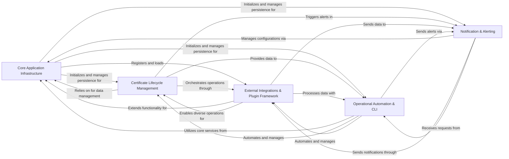

## Component Details

The Lemur application is a comprehensive certificate management system designed to automate the lifecycle of digital certificates. Its main flow involves initializing core services, managing certificate issuance, discovery, and deployment through a flexible plugin framework, automating operational tasks via CLI and background jobs, and providing robust notification and alerting capabilities for critical events.

### Core Application Infrastructure
This component is responsible for the fundamental setup and operation of the Lemur application, including initialization, configuration loading, database connectivity, Flask extensions (like ORM, migrations, security), and the overall web server lifecycle. It also manages user and role persistence and authentication/authorization.

**Related Classes/Methods**:

- `lemur.lemur.manage` (full file reference)
- `lemur.lemur.factory` (full file reference)
- `lemur.lemur.database` (full file reference)
- `lemur.lemur.users` (full file reference)
- `lemur.lemur.roles` (full file reference)
- `lemur.lemur.auth` (full file reference)

### Certificate Lifecycle Management
This component is the core of Lemur's functionality, managing the entire lifecycle of digital certificates. This includes creation, import, updating, revocation, export, rotation, reissue, and verification of certificates, as well as handling certificates that are pending issuance and managing integrated Certificate Authorities (CAs).

**Related Classes/Methods**:

- `lemur.lemur.certificates` (full file reference)
- `lemur.lemur.pending_certificates` (full file reference)
- `lemur.lemur.authorities` (full file reference)

### External Integrations & Plugin Framework
This comprehensive component provides the infrastructure for dynamically loading and managing various types of external integrations and plugins. It enables Lemur to interact with external systems for certificate issuance (e.g., ACME, DigiCert, AWS ACM), discovery (e.g., AWS ELB, S3), deployment (e.g., Kubernetes, SFTP, AWS), and DNS challenges.

**Related Classes/Methods**:

- `lemur.lemur.plugins.base.manager` (full file reference)
- `lemur.lemur.plugins.base.v1` (full file reference)
- `lemur.lemur.sources` (full file reference)
- `lemur.lemur.destinations` (full file reference)
- `lemur.lemur.dns_providers` (full file reference)
- `lemur.lemur.plugins.lemur_acme.plugin` (full file reference)
- `lemur.lemur.plugins.lemur_acme.acme_handlers` (full file reference)
- `lemur.lemur.plugins.lemur_acme.challenge_types` (full file reference)
- `lemur.lemur.plugins.lemur_acme.route53` (full file reference)
- `lemur.lemur.plugins.lemur_acme.nsone` (full file reference)
- `lemur.lemur.plugins.lemur_acme.powerdns` (full file reference)
- `lemur.lemur.plugins.lemur_acme.dyn` (full file reference)
- `lemur.lemur.plugins.lemur_acme.cloudflare` (full file reference)
- `lemur.lemur.plugins.lemur_acme.ultradns` (full file reference)
- `lemur.lemur.plugins.lemur_aws.plugin` (full file reference)
- `lemur.lemur.plugins.lemur_aws.acm` (full file reference)
- `lemur.lemur.plugins.lemur_aws.cloudfront` (full file reference)
- `lemur.lemur.plugins.lemur_aws.ec2` (full file reference)
- `lemur.lemur.plugins.lemur_aws.elb` (full file reference)
- `lemur.lemur.plugins.lemur_aws.iam` (full file reference)
- `lemur.lemur.plugins.lemur_aws.s3` (full file reference)
- `lemur.lemur.plugins.lemur_aws.sns` (full file reference)
- `lemur.lemur.plugins.lemur_digicert.plugin` (full file reference)
- `lemur.lemur.plugins.lemur_kubernetes.plugin` (full file reference)
- `lemur.lemur.plugins.lemur_sftp.plugin` (full file reference)
- `lemur.lemur.plugins.lemur_vault_dest.plugin` (full file reference)
- `lemur.lemur.plugins.lemur_jks.plugin` (full file reference)
- `lemur.lemur.plugins.lemur_openssl.plugin` (full file reference)
- `lemur.lemur.plugins.lemur_csr.plugin` (full file reference)
- `lemur.lemur.plugins.lemur_cfssl.plugin` (full file reference)
- `lemur.lemur.plugins.lemur_cryptography.plugin` (full file reference)
- `lemur.lemur.plugins.lemur_entrust.plugin` (full file reference)
- `lemur.lemur.plugins.lemur_google_ca.plugin` (full file reference)
- `lemur.lemur.plugins.lemur_verisign.plugin` (full file reference)
- `lemur.lemur.plugins.lemur_email.plugin` (full file reference)
- `lemur.lemur.plugins.lemur_slack.plugin` (full file reference)

### Operational Automation & CLI
This component provides command-line interfaces for administrative and operational tasks, enabling manual control and configuration. It also encompasses the background automation framework (Celery) for scheduled tasks such as certificate fetching, syncing, rotation, and expiration checks. It includes common utilities, schema definitions, and validators used across the application.

**Related Classes/Methods**:

- `lemur.lemur.common.celery` (full file reference)
- `lemur.lemur.certificates.cli` (full file reference)
- <a href="https://github.com/netflix/lemur/blob/master/lemur/sources/cli.py#L30-L31" target="_blank" rel="noopener noreferrer">`lemur.lemur.sources.cli` (30:31)</a>
- <a href="https://github.com/netflix/lemur/blob/master/lemur/pending_certificates/cli.py#L24-L25" target="_blank" rel="noopener noreferrer">`lemur.lemur.pending_certificates.cli` (24:25)</a>
- <a href="https://github.com/netflix/lemur/blob/master/lemur/api_keys/cli.py#L19-L20" target="_blank" rel="noopener noreferrer">`lemur.lemur.api_keys.cli` (19:20)</a>
- <a href="https://github.com/netflix/lemur/blob/master/lemur/dns_providers/cli.py#L15-L16" target="_blank" rel="noopener noreferrer">`lemur.lemur.dns_providers.cli` (15:16)</a>
- <a href="https://github.com/netflix/lemur/blob/master/lemur/notifications/cli.py#L24-L25" target="_blank" rel="noopener noreferrer">`lemur.lemur.notifications.cli` (24:25)</a>
- <a href="https://github.com/netflix/lemur/blob/master/lemur/policies/cli.py#L16-L17" target="_blank" rel="noopener noreferrer">`lemur.lemur.policies.cli` (16:17)</a>
- <a href="https://github.com/netflix/lemur/blob/master/lemur/reporting/cli.py#L17-L18" target="_blank" rel="noopener noreferrer">`lemur.lemur.reporting.cli` (17:18)</a>
- `lemur.lemur.common.utils` (full file reference)
- `lemur.lemur.common.schema` (full file reference)
- `lemur.lemur.common.validators` (full file reference)
- `lemur.lemur.common.defaults` (full file reference)
- `lemur.lemur.common.fields` (full file reference)
- `lemur.lemur.schemas` (full file reference)
- `lemur.lemur.endpoints` (full file reference)

### Notification & Alerting
This component is dedicated to managing and delivering various notifications and alerts within Lemur. It handles the creation, update, and dispatch of messages, particularly for critical events like certificate expirations, rotations, and operational failures, by leveraging configured notification plugins.

**Related Classes/Methods**:

- `lemur.lemur.notifications.messaging` (full file reference)
- `lemur.lemur.notifications.service` (full file reference)

### [FAQ](https://github.com/CodeBoarding/GeneratedOnBoardings/tree/main?tab=readme-ov-file#faq)