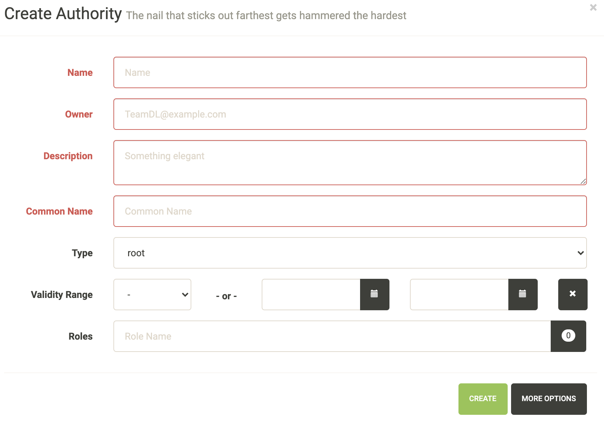
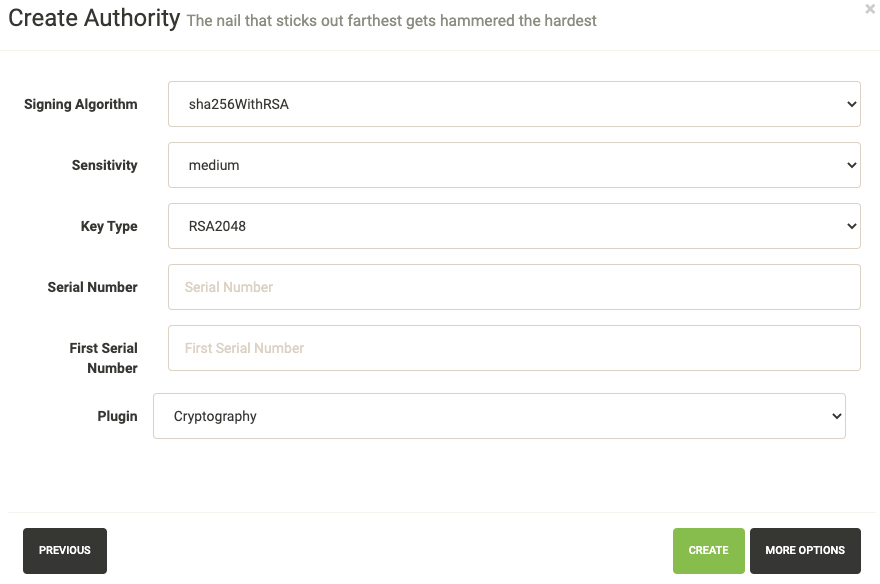
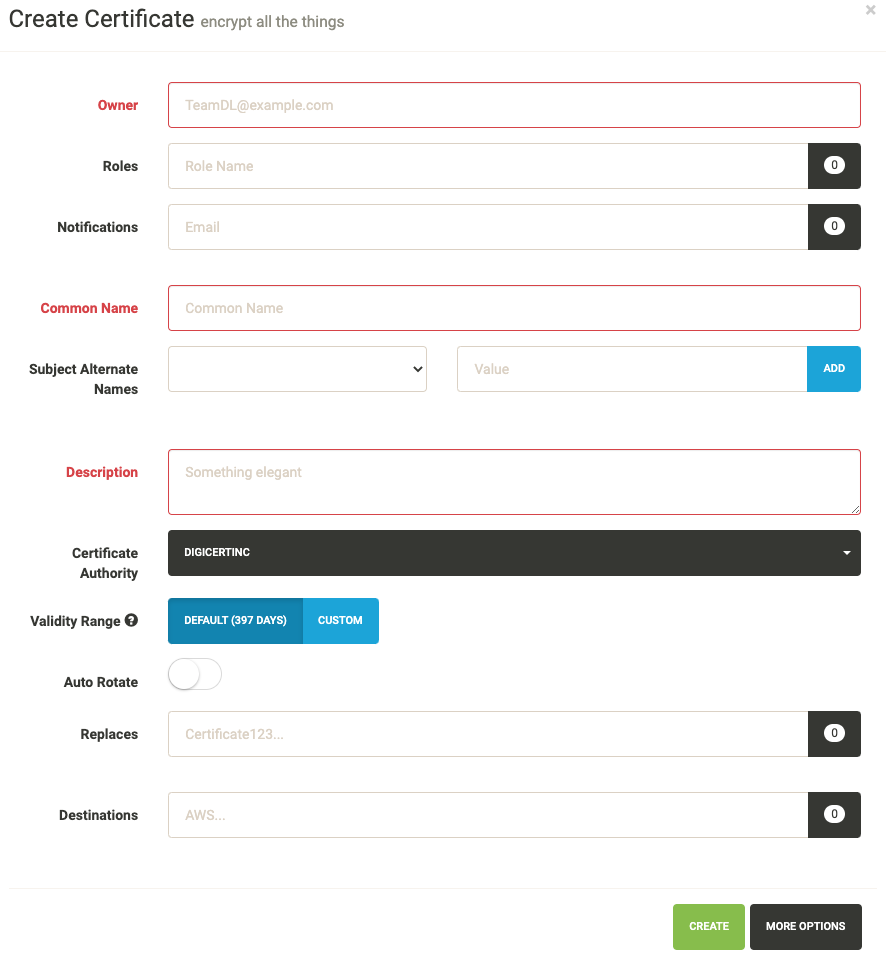
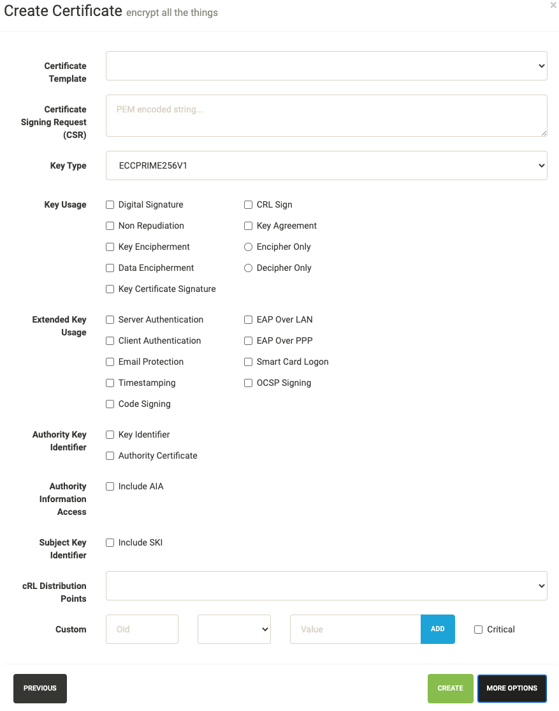
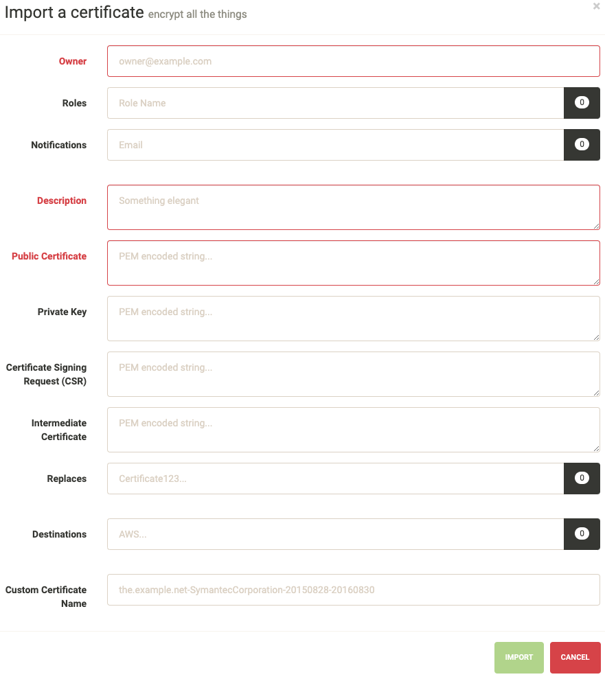

User Guide
==========

These guides are quick tutorials on how to perform basic tasks in Lemur.

Create a New Authority
~~~~~~~~~~~~~~~~~~~~~~

Before Lemur can issue certificates you must configure the authority you wish use. Lemur itself does
not issue certificates, it relies on external CAs and the plugins associated with those CAs to create the certificate
that Lemur can then manage.

    In the authority table select "Create"

    Enter an authority name and short description about the authority. Enter an owner,
    and certificate common name. Depending on the authority and the authority/issuer plugin
    these values may or may not be used.

    Again how many of these values get used largely depends on the underlying plugin. It
    is important to make sure you select the right plugin that you wish to use.

Create a New Certificate
~~~~~~~~~~~~~~~~~~~~~~~~

    In the certificate table select "Create"

    Enter an owner, common name, short description and certificate authority you wish to issue this certificate.
    Depending upon the selected CA, the UI displays default validity of the certificate. You can select different
    validity by entering a custom date, if supported by the CA.

    You can also add `Subject Alternate Names` or SAN for certificates that need to include more than one domains,
    The first domain is the Common Name and all other domains are added here as DNSName entries.

    You can add notification options and upload the created certificate to a destination, both
    of these are editable features and can be changed after the certificate has been created.

    These options are typically for advanced users. Lemur creates ECC based certificate (ECCPRIME256V1 in particular)
    by default. One can change the key type using the dropdown option listed here.

Import an Existing Certificate
~~~~~~~~~~~~~~~~~~~~~~~~~~~~~~

    Enter an owner, short description and public certificate. If there are intermediates and private keys
    Lemur will track them just as it does if the certificate were created through Lemur. Lemur generates
    a certificate name but you can override that by passing a value to the `Custom Certificate Name` field.

    You can add notification options and upload the created certificate to a destination, both
    of these are editable features and can be changed after the certificate has been created.

Create a New User
~~~~~~~~~~~~~~~~~

    From the settings dropdown select "Users"

    In the user table select "Create"

    Enter the username, email and password for the user. You can also assign any
    roles that the user will need when they login. While there is no deletion
    (we want to track creators forever) you can mark a user as 'Inactive' that will
    not allow them to login to Lemur.

Create a New Role
~~~~~~~~~~~~~~~~~

    From the settings dropdown select "Roles"

    In the role table select "Create"

    Enter a role name and short description about the role. You can optionally store
    a user/password on the role. This is useful if your authority require specific roles.
    You can then accurately map those roles onto Lemur users. Also optional you can assign
    users to your new role.

