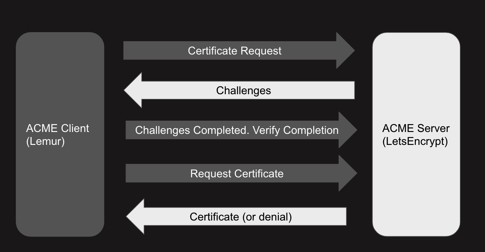
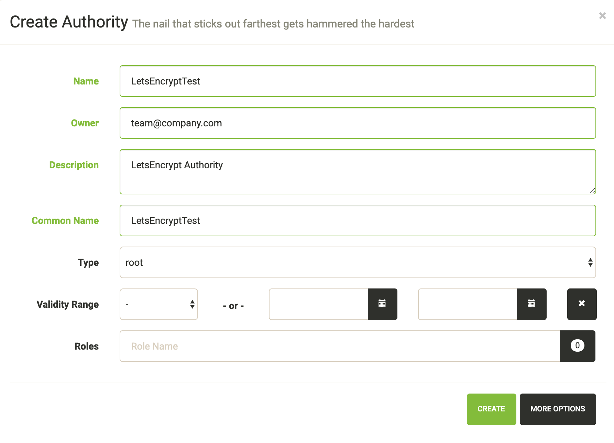
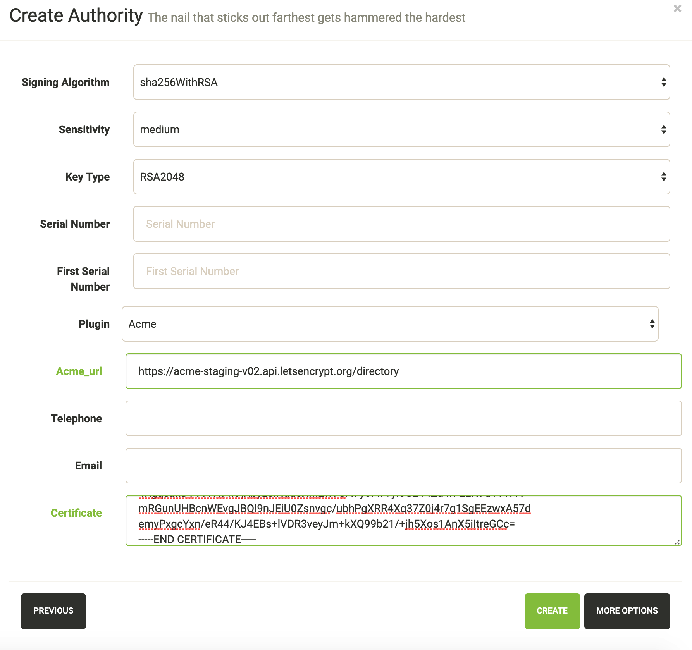
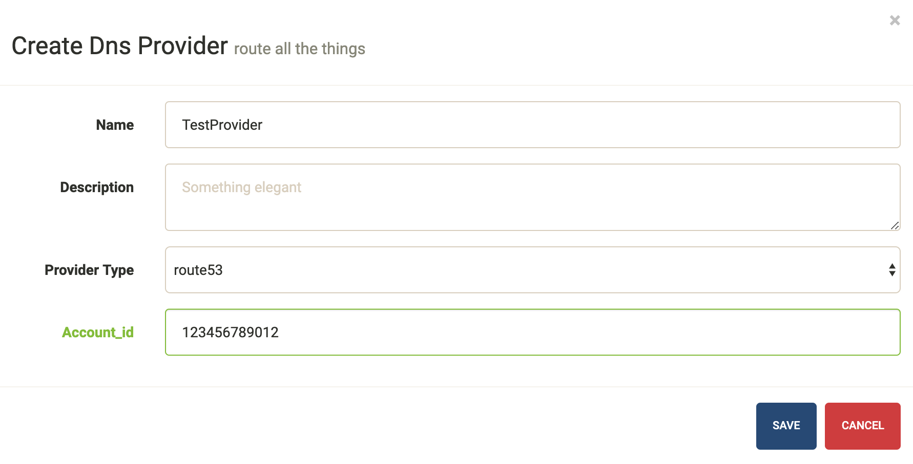

Production
**********

There are several steps needed to make Lemur production ready. Here we focus on making Lemur more reliable and secure.

Basics
======

Because of the sensitivity of the information stored and maintained by Lemur it is important that you follow standard host hardening practices:

- Run Lemur with a limited user
- Disabled any unneeded services
- Enable remote logging
- Restrict access to host

.. _CredentialManagement:

Credential Management
---------------------

Lemur often contains credentials such as mutual TLS keys or API tokens that are used to communicate with third party resources and for encrypting stored secrets. Lemur comes with the ability
to automatically encrypt these keys such that your keys not be in clear text.

The keys are located within lemur/keys and broken down by environment.

To utilize this ability use the following commands:

    ``lemur lock``

and

    ``lemur unlock``

If you choose to use this feature ensure that the keys are decrypted before Lemur starts as it will have trouble communicating with the database otherwise.

Entropy
-------

Lemur generates private keys for the certificates it creates. This means that it is vitally important that Lemur has enough entropy to draw from. To generate private keys Lemur uses the python library `Cryptography <https://cryptography.io>`_. In turn Cryptography uses OpenSSL bindings to generate
keys just like you might from the OpenSSL command line. OpenSSL draws its initial entropy from system during startup and uses PRNGs to generate a stream of random bytes (as output by /dev/urandom) whenever it needs to do a cryptographic operation.

What does all this mean? Well in order for the keys
that Lemur generates to be strong, the system needs to interact with the outside world. This is typically accomplished through the systems hardware (thermal, sound, video user-input, etc.) since the physical world is much more "random" than the computer world.

If you are running Lemur on its own server with its own hardware "bare metal" then the entropy of the system is typically "good enough" for generating keys. If however you are using a VM on shared hardware there is a potential that your initial seed data (data that was initially
fed to the PRNG) is not very good. What's more, VMs have been known to be unable to inject more entropy into the system once it has been started. This is because there is typically very little interaction with the server once it has been started.

The amount of effort you wish to expend ensuring that Lemur has good entropy to draw from is up to your specific risk tolerance and how Lemur is configured.

If you wish to generate more entropy for your system we would suggest you take a look at the following resources:

- `WES-entropy-client <https://github.com/Virginian/WES-entropy-client>`_
- `haveged <http://www.issihosts.com/haveged/>`_

For additional information about OpenSSL entropy issues:

- `Managing and Understanding Entropy Usage <https://www.blackhat.com/docs/us-15/materials/us-15-Potter-Understanding-And-Managing-Entropy-Usage.pdf>`_

TLS/SSL
=======

Nginx
-----

Nginx is a very popular choice to serve a Python project:

- It's fast.
- It's lightweight.
- Configuration files are simple.

Nginx doesn't run any Python process, it only serves requests from outside to
the Python server.

Therefore, there are two steps:

- Run the Python process.
- Run Nginx.

You will benefit from having:

- the possibility to have several projects listening to the port 80;
- your web site processes won't run with admin rights, even if --user doesn't
  work on your OS;
- the ability to manage a Python process without touching Nginx or the other
  processes. It's very handy for updates.

You must create a Nginx configuration file for Lemur. On GNU/Linux, they usually
go into /etc/nginx/conf.d/. Name it lemur.conf.

`proxy_pass` just passes the external request to the Python process.
The port must match the one used by the Lemur process of course.

You can make some adjustments to get a better user experience::

    server_tokens off;
    add_header X-Frame-Options DENY;
    add_header X-Content-Type-Options nosniff;
    add_header X-XSS-Protection "1; mode=block";

    server {
      listen       80;
      return       301 https://$host$request_uri;
    }

    server {
       listen      443;
       access_log  /var/log/nginx/log/lemur.access.log;
       error_log   /var/log/nginx/log/lemur.error.log;

       location /api {
            proxy_pass  http://127.0.0.1:8000;
            proxy_next_upstream error timeout invalid_header http_500 http_502 http_503 http_504;
            proxy_redirect off;
            proxy_buffering off;
            proxy_set_header        Host            $host;
            proxy_set_header        X-Real-IP       $remote_addr;
            proxy_set_header        X-Forwarded-For $proxy_add_x_forwarded_for;
        }

        location / {
            root /path/to/lemur/static/dist;
            include mime.types;
            index index.html;
        }

    }

This makes Nginx serve the favicon and static files which it is much better at than python.

It is highly recommended that you deploy TLS when deploying Lemur. This may be obvious given Lemur's purpose but the
sensitive nature of Lemur and what it controls makes this essential. This is a sample config for Lemur that also terminates TLS::

    server_tokens off;
    add_header X-Frame-Options DENY;
    add_header X-Content-Type-Options nosniff;
    add_header X-XSS-Protection "1; mode=block";

    server {
      listen       80;
      return       301 https://$host$request_uri;
    }

    server {
       listen      443;
       access_log  /var/log/nginx/log/lemur.access.log;
       error_log   /var/log/nginx/log/lemur.error.log;

       # certs sent to the client in SERVER HELLO are concatenated in ssl_certificate
       ssl_certificate /path/to/signed_cert_plus_intermediates;
       ssl_certificate_key /path/to/private_key;
       ssl_session_timeout 1d;
       ssl_session_cache shared:SSL:50m;

       # Diffie-Hellman parameter for DHE ciphersuites, recommended 2048 bits
       ssl_dhparam /path/to/dhparam.pem;

       # modern configuration. tweak to your needs.
       ssl_protocols TLSv1.1 TLSv1.2;
       ssl_ciphers 'ECDHE-RSA-AES128-GCM-SHA256:ECDHE-ECDSA-AES128-GCM-SHA256:ECDHE-RSA-AES256-GCM-SHA384:ECDHE-ECDSA-AES256-GCM-SHA384:DHE-RSA-AES128-GCM-SHA256:DHE-DSS-AES128-GCM-SHA256:kEDH+AESGCM:ECDHE-RSA-AES128-SHA256:ECDHE-ECDSA-AES128-SHA256:ECDHE-RSA-AES128-SHA:ECDHE-ECDSA-AES128-SHA:ECDHE-RSA-AES256-SHA384:ECDHE-ECDSA-AES256-SHA384:ECDHE-RSA-AES256-SHA:ECDHE-ECDSA-AES256-SHA:DHE-RSA-AES128-SHA256:DHE-RSA-AES128-SHA:DHE-DSS-AES128-SHA256:DHE-RSA-AES256-SHA256:DHE-DSS-AES256-SHA:DHE-RSA-AES256-SHA:!aNULL:!eNULL:!EXPORT:!DES:!RC4:!3DES:!MD5:!PSK';
       ssl_prefer_server_ciphers on;

       # HSTS (ngx_http_headers_module is required) (15768000 seconds = 6 months)
       add_header Strict-Transport-Security max-age=15768000;

       # OCSP Stapling ---
       # fetch OCSP records from URL in ssl_certificate and cache them
       ssl_stapling on;
       ssl_stapling_verify on;

       ## verify chain of trust of OCSP response using Root CA and Intermediate certs
       ssl_trusted_certificate /path/to/root_CA_cert_plus_intermediates;

       resolver <IP DNS resolver>;

       location /api {
            proxy_pass  http://127.0.0.1:8000;
            proxy_next_upstream error timeout invalid_header http_500 http_502 http_503 http_504;
            proxy_redirect off;
            proxy_buffering off;
            proxy_set_header        Host            $host;
            proxy_set_header        X-Real-IP       $remote_addr;
            proxy_set_header        X-Forwarded-For $proxy_add_x_forwarded_for;
        }

        location / {
            root /path/to/lemur/static/dist;
            include mime.types;
            index index.html;
        }

    }

.. Note:: Some paths will have to be adjusted based on where you have choose to install Lemur.

Apache
------

An example apache config::

    <VirtualHost *:443>
        ...
        SSLEngine on
        SSLCertificateFile      /path/to/signed_certificate
        SSLCertificateChainFile /path/to/intermediate_certificate
        SSLCertificateKeyFile   /path/to/private/key
        SSLCACertificateFile    /path/to/all_ca_certs

        # intermediate configuration, tweak to your needs
        SSLProtocol             all -SSLv2 -SSLv3
        SSLCipherSuite          ECDHE-RSA-AES128-GCM-SHA256:ECDHE-ECDSA-AES128-GCM-SHA256:ECDHE-RSA-AES256-GCM-SHA384:ECDHE-ECDSA-AES256-GCM-SHA384:DHE-RSA-AES128-GCM-SHA256:DHE-DSS-AES128-GCM-SHA256:kEDH+AESGCM:ECDHE-RSA-AES128-SHA256:ECDHE-ECDSA-AES128-SHA256:ECDHE-RSA-AES128-SHA:ECDHE-ECDSA-AES128-SHA:ECDHE-RSA-AES256-SHA384:ECDHE-ECDSA-AES256-SHA384:ECDHE-RSA-AES256-SHA:ECDHE-ECDSA-AES256-SHA:DHE-RSA-AES128-SHA256:DHE-RSA-AES128-SHA:DHE-DSS-AES128-SHA256:DHE-RSA-AES256-SHA256:DHE-DSS-AES256-SHA:DHE-RSA-AES256-SHA:AES128-GCM-SHA256:AES256-GCM-SHA384:AES128-SHA256:AES256-SHA256:AES128-SHA:AES256-SHA:AES:CAMELLIA:DES-CBC3-SHA:!aNULL:!eNULL:!EXPORT:!DES:!RC4:!MD5:!PSK:!aECDH:!EDH-DSS-DES-CBC3-SHA:!EDH-RSA-DES-CBC3-SHA:!KRB5-DES-CBC3-SHA
        SSLHonorCipherOrder     on

        # HSTS (mod_headers is required) (15768000 seconds = 6 months)
        Header always set Strict-Transport-Security "max-age=15768000"
        ...

     # Set the lemur DocumentRoot to static/dist
     DocumentRoot /www/lemur/lemur/static/dist

     # Uncomment to force http 1.0 connections to proxy
     # SetEnv force-proxy-request-1.0 1

     #Don't keep proxy connections alive
     SetEnv proxy-nokeepalive 1

     # Only need to do reverse proxy
     ProxyRequests Off

     # Proxy requests to the api to the lemur service (and sanitize redirects from it)
     ProxyPass "/api" "http://127.0.0.1:8000/api"
     ProxyPassReverse "/api" "http://127.0.0.1:8000/api"

    </VirtualHost>

Also included in the configurations above are several best practices when it comes to deploying TLS. Things like enabling
HSTS, disabling vulnerable ciphers are all good ideas when it comes to deploying Lemur into a production environment.

.. note::
    This is a rather incomplete apache config for running Lemur (needs mod_wsgi etc.), if you have a working apache config please let us know!

.. seealso::
    `Mozilla SSL Configuration Generator <https://mozilla.github.io/server-side-tls/ssl-config-generator/>`_

.. _UsingSupervisor:

Supervisor
==========

Supervisor is a very nice way to manage you Python processes. We won't cover
the setup (which is just apt-get install supervisor or pip install supervisor
most of the time), but here is a quick overview on how to use it.

Create a configuration file named supervisor.ini::

    [unix_http_server]
    file=/tmp/supervisor.sock

    [supervisorctl]
    serverurl=unix:///tmp/supervisor.sock

    [rpcinterface:supervisor]
    supervisor.rpcinterface_factory=supervisor.rpcinterface:make_main_rpcinterface

    [supervisord]
    logfile=/tmp/lemur.log
    logfile_maxbytes=50MB
    logfile_backups=2
    loglevel=trace
    pidfile=/tmp/supervisord.pid
    nodaemon=false
    minfds=1024
    minprocs=200

    [program:lemur]
    command=python /path/to/lemur/manage.py manage.py start

    directory=/path/to/lemur/
    environment=PYTHONPATH='/path/to/lemur/',LEMUR_CONF='/home/lemur/.lemur/lemur.conf.py'
    user=lemur
    autostart=true
    autorestart=true

The 4 first entries are just boiler plate to get you started, you can copy
them verbatim.

The last one defines one (you can have many) process supervisor should manage.

It means it will run the command::

    python manage.py start

In the directory, with the environment and the user you defined.

This command will be ran as a daemon, in the background.

`autostart` and `autorestart` just make it fire and forget: the site will always be
running, even it crashes temporarily or if you restart the machine.

The first time you run supervisor, pass it the configuration file::

    supervisord -c /path/to/supervisor.ini

Then you can manage the process by running::

    supervisorctl -c /path/to/supervisor.ini

It will start a shell from which you can start/stop/restart the service.

You can read all errors that might occur from /tmp/lemur.log.

Periodic Tasks
==============

Lemur contains a few tasks that are run and scheduled basis, currently the recommend way to run these tasks is to create
celery tasks or cron jobs that run these commands.

There are currently three commands that could/should be run on a periodic basis:

- `notify`
- `check_revoked`
- `sync`

If you are using LetsEncrypt, you must also run the following:

- `fetch_all_pending_acme_certs`
- `remove_old_acme_certs`

How often you run these commands is largely up to the user. `notify` and `check_revoked` are typically run at least once a day.
`sync` is typically run every 15 minutes. `fetch_all_pending_acme_certs` should be ran frequently (Every minute is fine).
`remove_old_acme_certs` can be ran more rarely, such as once every week.

Example cron entries::

    0 22 * * * lemuruser export LEMUR_CONF=/Users/me/.lemur/lemur.conf.py; /www/lemur/bin/lemur notify expirations
    */15 * * * * lemuruser export LEMUR_CONF=/Users/me/.lemur/lemur.conf.py; /www/lemur/bin/lemur source sync -s all
    0 22 * * * lemuruser export LEMUR_CONF=/Users/me/.lemur/lemur.conf.py; /www/lemur/bin/lemur certificate check_revoked

Example Celery configuration (To be placed in your configuration file)::

    CELERYBEAT_SCHEDULE = {
        'fetch_all_pending_acme_certs': {
            'task': 'lemur.common.celery.fetch_all_pending_acme_certs',
            'options': {
                'expires': 180
            },
            'schedule': crontab(minute="*"),
        },
        'remove_old_acme_certs': {
            'task': 'lemur.common.celery.remove_old_acme_certs',
            'options': {
                'expires': 180
            },
            'schedule': crontab(hour=7, minute=30, day_of_week=1),
        },
        'clean_all_sources': {
            'task': 'lemur.common.celery.clean_all_sources',
            'options': {
                'expires': 180
            },
            'schedule': crontab(hour=1, minute=0, day_of_week=1),
        },
        'sync_all_sources': {
            'task': 'lemur.common.celery.sync_all_sources',
            'options': {
                'expires': 180
            },
            'schedule': crontab(hour="*/3", minute=5),
        },
        'sync_source_destination': {
            'task': 'lemur.common.celery.sync_source_destination',
            'options': {
                'expires': 180
            },
            'schedule': crontab(hour="*"),
        }
    }

To enable celery support, you must also have configuration values that tell Celery which broker and backend to use.
Here are the Celery configuration variables that should be set::

    CELERY_RESULT_BACKEND = 'redis://your_redis_url:6379'
    CELERY_BROKER_URL = 'redis://your_redis_url:6379'
    CELERY_IMPORTS = ('lemur.common.celery')
    CELERY_TIMEZONE = 'UTC'

Do not forget to import crontab module in your configuration file::

    from celery.task.schedules import crontab

You must start a single Celery scheduler instance and one or more worker instances in order to handle incoming tasks.
The scheduler can be started with::

    LEMUR_CONF='/location/to/conf.py' /location/to/lemur/bin/celery -A lemur.common.celery beat

And the worker can be started with desired options such as the following::

    LEMUR_CONF='/location/to/conf.py' /location/to/lemur/bin/celery -A lemur.common.celery worker --concurrency 10 -E -n lemurworker1@%%h

supervisor or systemd configurations should be created for these in production environments as appropriate.

Add support for LetsEncrypt
===========================

LetsEncrypt is a free, limited-feature certificate authority that offers publicly trusted certificates that are valid
for 90 days. LetsEncrypt does not use organizational validation (OV), and instead relies on domain validation (DV).
LetsEncrypt requires that we prove ownership of a domain before we're able to issue a certificate for that domain, each
time we want a certificate.

The most common methods to prove ownership are HTTP validation and DNS validation. Lemur supports DNS validation
through the creation of DNS TXT records.

In a nutshell, when we send a certificate request to LetsEncrypt, they generate a random token and ask us to put that
token in a DNS text record to prove ownership of a domain. If a certificate request has multiple domains, we must
prove ownership of all of these domains through this method. The token is typically written to a TXT record at
-acme_challenge.domain.com. Once we create the appropriate TXT record(s), Lemur will try to validate propagation
before requesting that LetsEncrypt finalize the certificate request and send us the certificate.

To start issuing certificates through LetsEncrypt, you must enable Celery support within Lemur first. After doing so,
you need to create a LetsEncrypt authority. To do this, visit
Authorities -> Create. Set the applicable attributes and click "More Options".

You will need to set "Certificate" to LetsEncrypt's active chain of trust for the authority you want to use. To find
the active chain of trust at the time of writing, please visit `LetsEncrypt
<https://letsencrypt.org/certificates/>`_.

Under Acme_url, enter in the appropriate endpoint URL. Lemur supports LetsEncrypt's V2 API, and we recommend you to use
this. At the time of writing, the staging and production URLs for LetsEncrypt V2 are
https://acme-staging-v02.api.letsencrypt.org/directory and https://acme-v02.api.letsencrypt.org/directory.

After creating the authorities, we will need to create a DNS provider. Visit `Admin` -> `DNS Providers` and click
`Create`. Lemur comes with a few provider plugins built in, with different options. Create a DNS provider with the
appropriate choices.

By default, users will need to select the DNS provider that is authoritative over their domain in order for the
LetsEncrypt flow to function. However, Lemur will attempt to automatically determine the appropriate provider if
possible. To enable this functionality, periodically (or through Cron/Celery) run `lemur dns_providers get_all_zones`.
This command will traverse all DNS providers, determine which zones they control, and upload this list of zones to
Lemur's database (in the dns_providers table). Alternatively, you can manually input this data.

LetsEncrypt: pinning to cross-signed ICA
----------------------------------------

Let's Encrypt has been using a `cross-signed <https://letsencrypt.org/certificates/>`_ intermediate CA by DST Root CA X3,
which is included in many older devices' TrustStore.

Let's Encrypt is `transitioning <https://letsencrypt.org/2019/04/15/transitioning-to-isrg-root.html>`_ to use
the intermediate CA issued by their own root (ISRG X1) starting from September 29th 2020.
This is in preparation of concluding the initial bootstrapping of their CA, by having it cross-signed by an older CA.

Lemur can temporarily pin to the cross-signed intermediate CA (same public/private key pair as the ICA signed by ISRG X1).
This will prolong support for incompatible devices.

The following must be added to the config file to activate the pinning (the pinning will be removed by September 2021)::

    # remove or update after Mar 17 16:40:46 2021 GMT
    IDENTRUST_CROSS_SIGNED_LE_ICA_EXPIRATION_DATE = "17/03/21"
    IDENTRUST_CROSS_SIGNED_LE_ICA = """
    -----BEGIN CERTIFICATE-----
    MIIEkjCCA3qgAwIBAgIQCgFBQgAAAVOFc2oLheynCDANBgkqhkiG9w0BAQsFADA/
    MSQwIgYDVQQKExtEaWdpdGFsIFNpZ25hdHVyZSBUcnVzdCBDby4xFzAVBgNVBAMT
    DkRTVCBSb290IENBIFgzMB4XDTE2MDMxNzE2NDA0NloXDTIxMDMxNzE2NDA0Nlow
    SjELMAkGA1UEBhMCVVMxFjAUBgNVBAoTDUxldCdzIEVuY3J5cHQxIzAhBgNVBAMT
    GkxldCdzIEVuY3J5cHQgQXV0aG9yaXR5IFgzMIIBIjANBgkqhkiG9w0BAQEFAAOC
    AQ8AMIIBCgKCAQEAnNMM8FrlLke3cl03g7NoYzDq1zUmGSXhvb418XCSL7e4S0EF
    q6meNQhY7LEqxGiHC6PjdeTm86dicbp5gWAf15Gan/PQeGdxyGkOlZHP/uaZ6WA8
    SMx+yk13EiSdRxta67nsHjcAHJyse6cF6s5K671B5TaYucv9bTyWaN8jKkKQDIZ0
    Z8h/pZq4UmEUEz9l6YKHy9v6Dlb2honzhT+Xhq+w3Brvaw2VFn3EK6BlspkENnWA
    a6xK8xuQSXgvopZPKiAlKQTGdMDQMc2PMTiVFrqoM7hD8bEfwzB/onkxEz0tNvjj
    /PIzark5McWvxI0NHWQWM6r6hCm21AvA2H3DkwIDAQABo4IBfTCCAXkwEgYDVR0T
    AQH/BAgwBgEB/wIBADAOBgNVHQ8BAf8EBAMCAYYwfwYIKwYBBQUHAQEEczBxMDIG
    CCsGAQUFBzABhiZodHRwOi8vaXNyZy50cnVzdGlkLm9jc3AuaWRlbnRydXN0LmNv
    bTA7BggrBgEFBQcwAoYvaHR0cDovL2FwcHMuaWRlbnRydXN0LmNvbS9yb290cy9k
    c3Ryb290Y2F4My5wN2MwHwYDVR0jBBgwFoAUxKexpHsscfrb4UuQdf/EFWCFiRAw
    VAYDVR0gBE0wSzAIBgZngQwBAgEwPwYLKwYBBAGC3xMBAQEwMDAuBggrBgEFBQcC
    ARYiaHR0cDovL2Nwcy5yb290LXgxLmxldHNlbmNyeXB0Lm9yZzA8BgNVHR8ENTAz
    MDGgL6AthitodHRwOi8vY3JsLmlkZW50cnVzdC5jb20vRFNUUk9PVENBWDNDUkwu
    Y3JsMB0GA1UdDgQWBBSoSmpjBH3duubRObemRWXv86jsoTANBgkqhkiG9w0BAQsF
    AAOCAQEA3TPXEfNjWDjdGBX7CVW+dla5cEilaUcne8IkCJLxWh9KEik3JHRRHGJo
    uM2VcGfl96S8TihRzZvoroed6ti6WqEBmtzw3Wodatg+VyOeph4EYpr/1wXKtx8/
    wApIvJSwtmVi4MFU5aMqrSDE6ea73Mj2tcMyo5jMd6jmeWUHK8so/joWUoHOUgwu
    X4Po1QYz+3dszkDqMp4fklxBwXRsW10KXzPMTZ+sOPAveyxindmjkW8lGy+QsRlG
    PfZ+G6Z6h7mjem0Y+iWlkYcV4PIWL1iwBi8saCbGS5jN2p8M+X+Q7UNKEkROb3N6
    KOqkqm57TH2H3eDJAkSnh6/DNFu0Qg==
    -----END CERTIFICATE-----
    """
